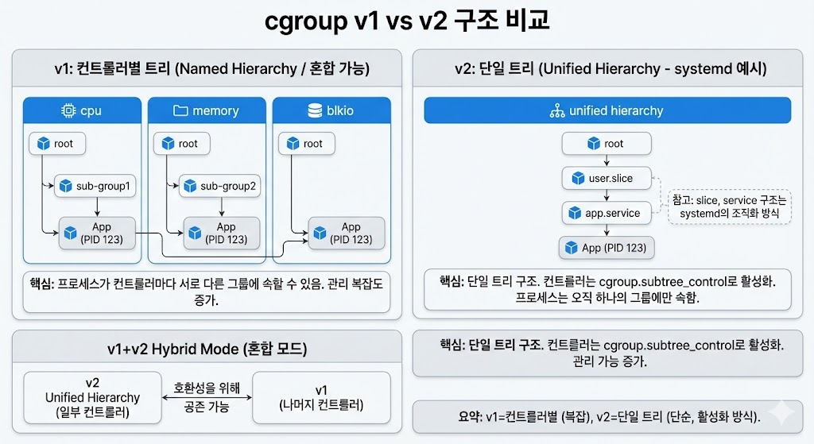

:::note[섹션 개요]

- 구조/경로/컨트롤러 차이를 한눈에 비교한다.
- 내 환경이 v1인지 v2인지 빠르게 확인한다.
  :::

실습중에 실습 내용은 v1 기준이고 내 환경은 v2라서, 명령어는 비슷한데 파일 위치가 자주 안 맞았다.
그때마다 흐름이 끊기는 게 싫어서 “구조가 다르면 경로와 파일 이름도 달라진다”부터 정리해 두기로 했다.



## 핵심 차이 4가지

**1) 계층 구조**
v1은 컨트롤러별로 여러 트리를 만든다. v2는 모든 컨트롤러가 하나의 트리(단일 계층)를 공유한다.

**2) 경로 구조**
v1은 `/sys/fs/cgroup/` 아래에 `cpu`, `memory`, `blkio` 같은 디렉터리가 각각 존재한다.
v2는 루트 하나에 공통 파일이 있고, 그 아래로 cgroup 디렉터리가 쌓인다.

**3) 컨트롤러 활성화 방식**
v2는 컨트롤러가 상위 cgroup에서 활성화되어야 자식에서 쓸 수 있다. 다만 systemd 환경에서는 루트나 slice에서 이미 켜 둔 경우가 많아, 직접 건드릴 일이 적다.

**4) 파일 이름 차이**
v1에서 CPU 제한은 `cpu.cfs_quota_us` + `cpu.cfs_period_us`로 설정하지만, v2에서는 `cpu.max`로 바뀐다.
또 v2에서는 `tasks` 파일이 사라지고 `cgroup.procs` 중심으로 다룬다.
자주 보는 것만 몇 개 더 적어두면 아래 정도다.

- v1 `cpu.shares` → v2 `cpu.weight`
- v1 `memory.limit_in_bytes` → v2 `memory.max`
- v1 `memory.soft_limit_in_bytes` → v2 `memory.high`
- v1 `memory.usage_in_bytes` → v2 `memory.current`
- v1 `blkio.*` 계열 → v2 `io.*` 계열 (`io.max`, `io.weight` 등)

## 구조 변화에서 중요한 비교 포인트

**A) 마운트/디렉터리 구조**
v1은 컨트롤러마다 마운트가 따로 있고, 그 아래에 cgroup 디렉터리를 만든다. 그래서 `cpu`, `memory`, `blkio`가 각각 다른 트리를 가진다.
v2는 `/sys/fs/cgroup/` 하나의 트리로 통합된다. 모든 컨트롤러가 같은 경로를 공유한다.
즉, “트리가 여러 개냐 하나냐”가 핵심이다.

**B) 프로세스 배치 방식**
v1은 컨트롤러별 트리가 달라서 같은 프로세스가 컨트롤러마다 “다른 경로”에 있을 수 있다.
v2는 프로세스가 하나의 cgroup 경로에 묶이고, 그 경로에 모든 컨트롤러가 적용된다.
상위 cgroup에는 프로세스를 두지 않는 원칙(일명 no internal process)이 기본이다.
그래서 실무에서는 서비스 프로세스를 보통 leaf cgroup에 둔다.

**C) 컨트롤러 상속/활성화 흐름**
v1은 해당 컨트롤러 트리에 들어가면 바로 제어 파일이 있다.
v2는 부모에서 `cgroup.subtree_control`로 컨트롤러를 켜야 자식에서 제한 파일을 쓸 수 있다.
이 흐름을 모르면 자식에서 제한 파일이 안 먹는 이유를 놓치기 쉽다.

**D) 컨트롤러 이름과 파일 체계**
v1은 `blkio` 같은 컨트롤러 디렉터리 이름을 그대로 쓴다.
v2는 `io.*` 계열로 단순화되었고, 공통 파일(`cgroup.procs`, `cgroup.controllers`)이 루트에 있다.
파일 이름을 외우기보다 바뀐 이유만 감 잡아두면 된다.

## 내 환경이 v1인지 v2인지 빠르게 확인

```bash
lin> stat -fc %T /sys/fs/cgroup
```

- `cgroup2fs`면 v2
- `tmpfs`면 v1
