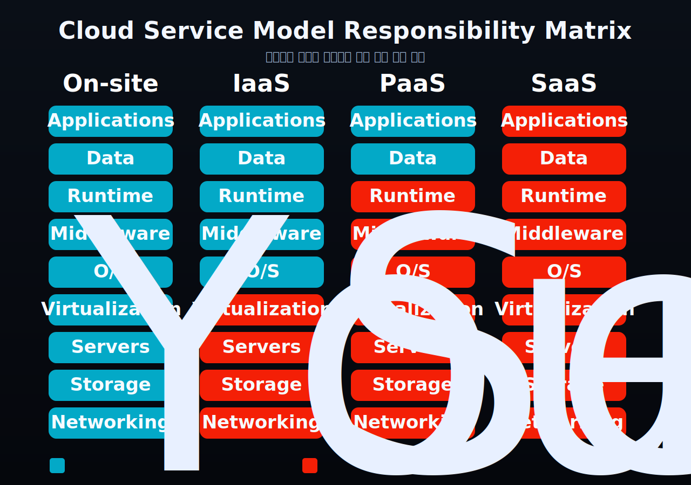

:::note[섹션 개요]

- 클라우드가 무엇인지 짧고 명확하게 이해한다.
- IaaS, PaaS, SaaS의 차이를 책임 범위 중심으로 구분한다.
- 실제 상황에서 어떤 모델을 고를지 기준을 잡는다.
  :::

## 먼저, 클라우드가 뭔가?

클라우드는 서버, 스토리지, 네트워크, 소프트웨어 같은 IT 자원을
**필요할 때 인터넷으로 빌려 쓰는 방식**이다.

예전처럼 장비를 직접 구매하고 설치하지 않아도 된다.
대신 필요한 만큼 빠르게 만들고, 쓰는 만큼 비용을 낸다.

클라우드를 이해할 때 핵심은 3가지다.

- **온디맨드(On-demand)**: 필요할 때 바로 생성/삭제 가능
- **탄력성(Elasticity)**: 트래픽 증가에 따라 쉽게 확장 가능
- **사용량 기반 과금(Pay-as-you-go)**: 초기 투자 대신 운영비 중심

## IaaS, PaaS, SaaS를 나누는 기준

<strong>누가 어디까지 관리하느냐(관리 책임 분담)</strong>에 있다.

> 그림 1. IaaS/PaaS/SaaS는 기능 차이보다 책임 범위 차이다.

## IaaS (Infrastructure as a Service)

IaaS는 인프라(가상 서버, 네트워크, 디스크)를 서비스로 제공한다.
운영체제부터 애플리케이션까지는 사용자가 더 많이 책임진다.

- 제공자: 물리 서버, 가상화, 스토리지/네트워크 기반
- 사용자: OS 설정, 미들웨어, 런타임, 앱 배포/운영

### 이럴 때 적합하다

- OS 레벨 제어가 필요할 때
- 커스텀 네트워크/보안 구성이 중요할 때
- 레거시 시스템 이전(리프트 앤 시프트)할 때

## PaaS (Platform as a Service)

PaaS는 애플리케이션 실행 플랫폼까지 제공한다.
사용자는 주로 코드와 데이터에 집중하면 된다.

- 제공자: 인프라 + OS + 런타임 + 배포 환경
- 사용자: 애플리케이션 코드, 비즈니스 로직, 데이터

### 이럴 때 적합하다

- 빠른 개발/배포가 필요할 때
- 인프라 운영 인력이 적을 때
- MVP나 내부 서비스처럼 출시 속도가 중요할 때

## SaaS (Software as a Service)

SaaS는 완성된 소프트웨어를 구독형으로 쓰는 형태다.
사용자는 계정/권한/업무 설정 중심으로 관리한다.

- 제공자: 앱 전체(인프라부터 기능 업데이트까지)
- 사용자: 사용 정책, 데이터 입력, 운영 프로세스

### 이럴 때 적합하다

- 협업 도구, 메일, CRM처럼 공통 업무를 빠르게 도입할 때
- 구축보다 즉시 사용이 중요할 때

## 한눈 비교표

| 항목           | IaaS                 | PaaS                 | SaaS                 |
| -------------- | -------------------- | -------------------- | -------------------- |
| 내가 주로 관리 | OS, 미들웨어, 앱     | 앱, 데이터           | 사용자 설정, 데이터  |
| 인프라 제어력  | 높음                 | 중간                 | 낮음                 |
| 개발 속도      | 중간                 | 빠름                 | 매우 빠름(즉시 사용) |
| 운영 부담      | 큼                   | 중간                 | 작음                 |
| 커스터마이징   | 매우 높음            | 높음(플랫폼 범위 내) | 제한적               |
| 대표 사용 예   | 가상머신 기반 서비스 | 앱 백엔드/웹앱 배포  | 협업/메일/업무툴     |

## 실무에서 고르는 기준

정답은 하나가 아니라, **서비스별로 섞어 쓰는 것**이 일반적이다.

1. 인프라 제어가 중요하면 `IaaS`
2. 개발 생산성이 최우선이면 `PaaS`
3. 공통 업무를 빠르게 도입하려면 `SaaS`

예를 들면 이런 조합이 흔하다.

- 고객용 핵심 서비스: IaaS 또는 PaaS
- 사내 협업/문서/메일: SaaS
- 데이터/로그 분석: 관리형 PaaS + 일부 IaaS

## 자주 하는 오해 3가지

1. **PaaS는 무조건 자유도가 낮다**
   실제로는 운영 부담을 줄이는 대신 제어 범위를 조정하는 선택이다.

2. **IaaS가 항상 더 싸다**
   인프라 단가만 보면 그럴 수 있지만, 운영 인건비/장애 대응 비용까지 보면 달라진다.

3. **SaaS는 기술팀이 필요 없다**
   도입 후 권한 정책, 데이터 거버넌스, 연동 설계는 여전히 중요하다.

## 결론

IaaS, PaaS, SaaS는 우열이 아니라 **문제와 팀 상황에 맞는 도구 선택**이다.
클라우드 설계의 핵심은 기술 스택보다 먼저
`우리 팀이 어디까지 직접 운영할 것인가`를 결정하는 데 있다.
