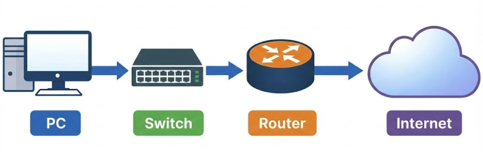
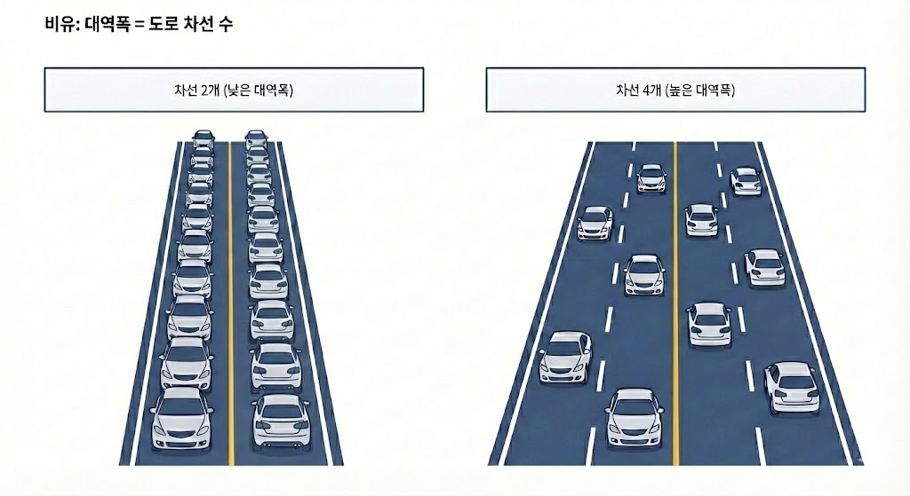
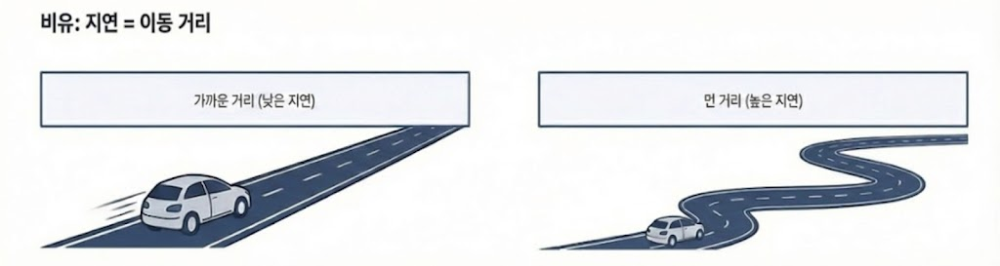

# 01 네트워크 기초 개념 (학습 노트)

:::note[섹션 개요]
- 네트워크의 목적과 성능 지표를 정확히 설명한다.
- 네트워크 3가지 목적 설명 가능
- 대역폭/지연/손실/지터 차이 설명 가능
- 현실 문제(느림/끊김/지연)를 네트워크 개념으로 해석한다.
- LAN/WAN/인터넷/VPC 차이를 구분한다.
:::

---

## 01.1 네트워크란 무엇인가
네트워크는 **여러 장치가 데이터를 주고받기 위한 연결과 규칙의 집합**이다.


> 그림 01-1. 네트워크 기본 구성 요소

### 네트워크의 3가지 목적
1) **연결성(Connectivity)**: 장치 간 통신 가능
2) **신뢰성(Reliability)**: 데이터가 손실 없이 도착
3) **확장성(Scalability)**: 트래픽 증가에도 유지

### 현실 예시
- 회사 인트라넷이 느리다 → 대역폭/혼잡 문제
- 화상회의가 끊긴다 → 지터/손실 문제
- 게임 핑이 높다 → 지연 문제

---

## 01.2 성능 지표 4가지

### 2.1 대역폭(Bandwidth)
- 초당 전송 가능한 **최대 데이터량**
- 비유: 도로의 차선 수


> 그림 01-2. 대역폭 비유

### 2.2 지연(Latency)
- 패킷이 목적지까지 가는 시간(왕복: RTT)
- 비유: 도로의 길이


> 그림 01-3. 지연 비유

### 2.3 손실(Loss)
- 중간 경로에서 패킷 유실
- 손실이 많으면 재전송 증가 → 체감 속도 저하

### 2.4 지터(Jitter)
- 지연이 불규칙하게 흔들리는 현상
- 실시간 스트리밍/통화에 치명적

---

## 01.3 네트워크 구성 요소
- **노드(Node)**: PC, 서버, 라우터, 스위치
- **링크(Link)**: 케이블/무선
- **프로토콜(Protocol)**: TCP/IP, HTTP, DNS 등

```text
[PC] --- (케이블/Wi-Fi) --- [스위치] --- [라우터] --- (인터넷)
```

---

## 01.4 네트워크 유형
- **LAN**: 근거리 네트워크 (집/회사)
- **WAN**: 광역 네트워크 (도시/국가)
- **인터넷**: 전세계 WAN의 결합
- **VPC/VNet**: 클라우드의 가상 네트워크

---

## 01.5 실습 1: 내 네트워크 정보 확인

### 목표
- IP, 게이트웨이, DNS를 확인한다.

### macOS
```shellsession
mac> ifconfig | grep inet
mac> route -n get default
mac> scutil --dns | head -n 20
```

### Windows (PowerShell)
```shellsession
win> ipconfig /all
win> Get-NetIPConfiguration
```

### Linux
```shellsession
lin> ip addr show
lin> ip route
lin> resolvectl status | head -n 20
```

### 예상 출력 (요약)
```
inet 192.168.0.15 netmask 0xffffff00 broadcast 192.168.0.255
route to: default
    gateway: 192.168.0.1
```

### 확인 포인트
- IP가 사설 대역인지 확인
- 게이트웨이가 같은 네트워크인지 확인

### 자주 발생하는 문제
- IP가 169.254.x.x → DHCP 실패
- DNS가 비어 있음 → 이름 해석 불가

---

## 01.6 체크리스트
- 네트워크 3가지 목적 설명 가능
- 대역폭/지연/손실/지터 차이 설명 가능
- 내 PC의 IP/게이트웨이/DNS 확인 가능

## 01.7 복습 문제
1) 대역폭과 지연의 차이를 설명하라.
2) 스트리밍 끊김이 발생할 때 가장 의심할 지표는?
3) 169.254.x.x IP가 뜨는 이유는?

---

## 01.8 심화 이론: 속도 vs 체감 품질
- **대역폭이 넓어도 지연이 크면** 체감은 느릴 수 있다.
- **지연이 낮아도 손실이 크면** 재전송으로 체감이 나빠진다.

### 쉬운 비유
- 대역폭: 한 번에 많은 차를 보내는 고속도로
- 지연: 톨게이트까지 거리
- 손실: 중간에서 차가 탈락

---

## 01.9 실전 시나리오
### 상황: 영상 회의가 끊긴다
1) 지연/지터 측정 (핑, 지속적인 패킷)
2) Wi-Fi → 유선 전환
3) 백그라운드 다운로드 중지

### 문제 해석
- 지터가 크면 음성이 끊김
- 손실이 높으면 화면이 깨짐

---

## 01.10 추가 실습: 네트워크 품질 측정
### macOS
```shellsession
mac> ping -c 20 8.8.8.8
mac> traceroute 8.8.8.8
```

### Windows
```shellsession
win> ping -n 20 8.8.8.8
win> tracert 8.8.8.8
```

### Linux
```shellsession
lin> ping -c 20 8.8.8.8
lin> traceroute 8.8.8.8
```

### 예상 출력 해석
- `time=XX ms`가 크게 변동 → 지터 가능성
- 중간 홉에서 응답 없음 → 방화벽일 수도 있음

---

## 01.11 추가 문제 + 모범답안
1) **문제**: 대역폭은 충분한데 게임 핑이 높다. 원인은?
   **답**: 지연(거리/경로 문제) 가능성이 높음.
2) **문제**: 스트리밍이 자주 끊긴다. 가장 의심할 지표는?
   **답**: 손실과 지터.

---
## 01.12 실전 사례
- 사례 1: 사내 파일 전송이 느림 → 대역폭 포화, 백업 스케줄 분산 필요.
- 사례 2: 영상 통화가 끊김 → 지터/손실 증가, Wi-Fi 간섭 확인.
- 사례 3: 게임 핑 급증 → 라우팅 경로 변경, ISP 경로 추적 필요.
---
## 01.13 장애 분석 리포트 템플릿
- 발생 시각:
- 증상:
- 영향 범위:
- 원인:
- 해결:
- 재발 방지:

---
## 01.x 초보자용 자세한 설명

### 대역폭 vs 지연
- **대역폭**은 한 번에 얼마나 많이 보낼 수 있는지(용량)다.
- **지연**은 한 번 왕복하는 데 걸리는 시간(속도감)이다.
- 대역폭이 커도 지연이 크면 체감은 느릴 수 있다.

### 손실/지터가 왜 중요한가
- **손실**은 패킷이 중간에 사라지는 것이라 재전송이 발생한다.
- **지터**는 지연이 들쑥날쑥한 상태라 실시간 음성/영상이 끊긴다.

---
## 초보자 Q&A
Q1) 개념이 너무 어렵다. 어디부터 보면 되나?
A1) 그림 → 요약 → 실습 순으로 반복하면 이해가 빨라진다.

Q2) 실습이 실패하면?
A2) IP/라우팅/DNS/포트 순으로 원인을 좁혀라.

---
## 초보자 완전 해설

### 네트워크를 한 줄로 말하면
- "컴퓨터들이 서로 이야기하게 해주는 길"이다.

### 왜 인터넷이 느려질까
- **길이 좁으면(대역폭 부족)** → 동시에 많이 못 보낸다.
- **길이 멀면(지연 증가)** → 왕복 시간이 길다.
- **길이 흔들리면(지터)** → 영상/음성이 끊긴다.

### 체감 문제 해석
- 웹페이지 로딩이 느림: 지연 가능성
- 영상 끊김: 손실/지터 가능성
- 큰 파일 전송 느림: 대역폭 가능성

### 실생활 비유
- 대역폭: 고속도로 차선 수
- 지연: 집에서 회사까지 거리
- 손실: 중간에 사고로 떨어지는 차량

---
## 초보자 미니 퀴즈
1) 인바운드는 어느 방향인가?
2) DNS는 왜 필요한가?
3) TCP가 UDP보다 느린 이유는?

### 정답
1) 밖 → 안
2) 이름을 IP로 바꾸기 위해
3) 확인/재전송 과정이 있기 때문

