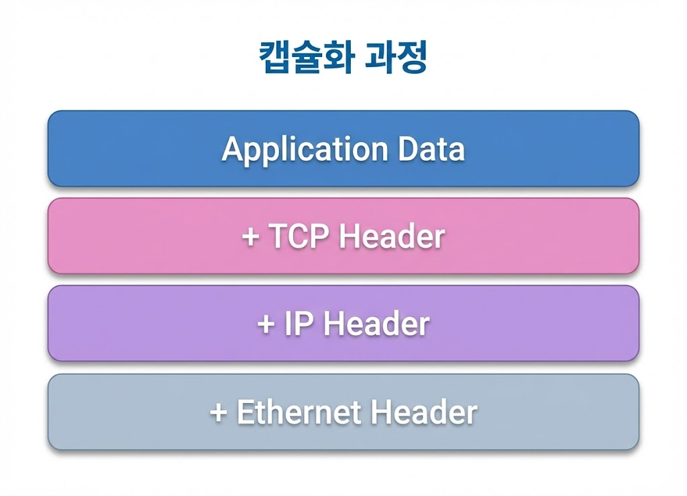
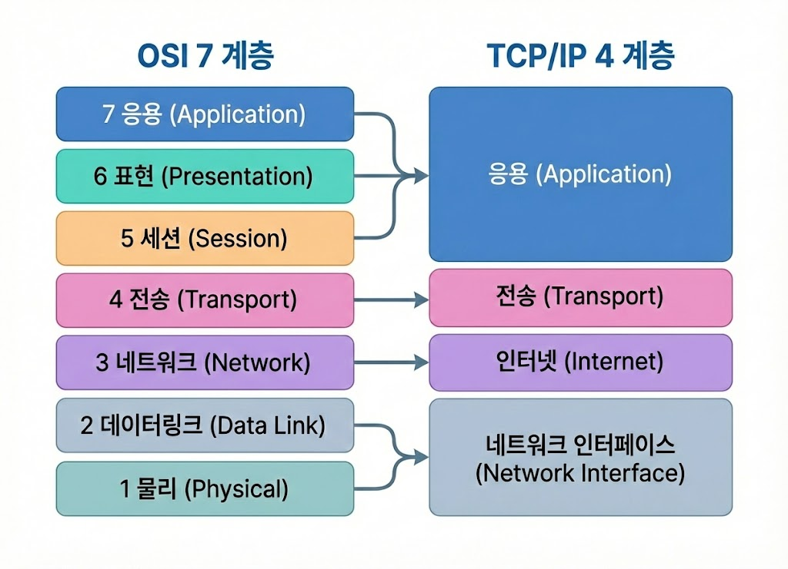

# 02 계층과 프로토콜 (학습 노트)

:::note[섹션 개요]
제목: 02 계층과 프로토콜 (학습 노트)
키워드: 핵심 개념, 실습, 점검
학습 목표:

- OSI 7계층과 TCP/IP 모델의 차이를 정확히 설명한다.
- OSI 7계층 순서를 설명 가능
- 문제를 계층별로 분리해 진단할 수 있다.
  :::



> 그림 02-1. OSI 7계층과 TCP/IP 매핑



> 그림 02-2. 캡슐화 과정

---

## 02.2 OSI 7계층과 TCP/IP

### OSI 7계층 (교육용 개념 모델)

1. 물리(Physical)
2. 데이터링크(Data Link)
3. 네트워크(Network)
4. 전송(Transport)
5. 세션(Session)
6. 표현(Presentation)
7. 응용(Application)

### TCP/IP (실제 인터넷 모델)

1. 네트워크 인터페이스
2. 인터넷
3. 전송
4. 응용

```
OSI:    7 응용
        6 표현
        5 세션
        4 전송
        3 네트워크
        2 데이터링크
        1 물리

TCP/IP: 4 응용
        3 전송
        2 인터넷
        1 네트워크 인터페이스
```

### 왜 두 모델이 있는가

- OSI: 교육/분석용으로 세분화
- TCP/IP: 현실에서 동작하는 단순 모델

---

## 02.3 계층별 핵심 역할 (실무 관점)

### 2.1 물리 계층

- 케이블, 전기 신호, 무선
- 증상: 케이블 불량, 링크 다운

### 2.2 데이터링크 계층

- MAC 주소, 프레임 전달, 스위칭
- 증상: ARP 실패, 브로드캐스트 폭주

### 2.3 네트워크 계층

- IP 주소, 라우팅
- 증상: 다른 네트워크 접근 불가

### 2.4 전송 계층

- TCP/UDP, 포트, 세션
- 증상: 특정 포트 접속 불가

### 2.5 응용 계층

- HTTP, DNS, SSH
- 증상: 서비스 자체 오류

---

## 02.4 계층 분리의 이점

- 문제 진단이 빠르고 명확해짐
- 변경 영향 범위를 최소화

### 예시

웹 접속 실패 →

- 물리: 링크 연결 확인
- 네트워크: IP 할당 확인
- 전송: 포트 차단 확인
- 응용: 서버 상태 확인

---

## 02.5 실습 1: 계층 흐름 관찰

### 목표

DNS → TCP → TLS → HTTP 흐름을 직접 확인한다.

### macOS / Linux

```shellsession
mac> dig example.com
mac> curl -v https://example.com
```

### Windows (PowerShell)

```shellsession
win> nslookup example.com
win> curl -v https://example.com
```

### 예상 출력 (요약)

```
*   Trying 93.184.216.34:443...
* Connected to example.com (93.184.216.34)
* TLS handshake, Client hello
> GET / HTTP/1.1
< HTTP/1.1 200 OK
```

### 해석

- DNS: 이름 → IP
- TCP: 연결 수립
- TLS: 암호화 세션
- HTTP: 응답 수신

---

## 02.6 실습 2: 포트/계층 문제 구분

### 목표

포트가 막혔을 때와 DNS가 실패했을 때 증상을 비교한다.

### 단계

1. DNS 확인

```shellsession
mac> dig example.com
```

2. 포트 확인

```shellsession
mac> nc -vz example.com 443
```

### 예상 결과

- DNS 실패: IP 자체가 안 나옴
- 포트 실패: 연결 시도 후 timeout

---

## 02.7 체크리스트

- OSI 7계층 순서를 설명 가능
- TCP/IP 모델과 매핑 가능
- 계층별 문제를 구분해서 진단 가능

## 02.8 복습 문제

1. 전송 계층에서 주로 다루는 것은?
2. DNS는 OSI 몇 계층인가?
3. 포트 차단과 DNS 실패의 증상 차이는?

---

## 02.9 심화 이론: 캡슐화/역캡슐화

데이터는 상위 계층에서 하위 계층으로 내려갈 때 **헤더가 붙는다**.
이를 **캡슐화**라 하고, 수신 측에서는 역으로 **역캡슐화**가 진행된다.

```
HTTP 데이터
→ TCP 헤더 추가
→ IP 헤더 추가
→ 이더넷 헤더 추가
→ 전송
```

---

## 02.10 OS별 실습: 계층별 문제 진단 순서

### macOS

```shellsession
mac> ifconfig | grep status
mac> ping -c 3 8.8.8.8
mac> dig example.com
mac> nc -vz example.com 443
```

### Windows

```shellsession
win> Get-NetAdapter | ft Name, Status
win> ping -n 3 8.8.8.8
win> nslookup example.com
win> Test-NetConnection example.com -Port 443
```

### Linux

```shellsession
lin> ip link
lin> ping -c 3 8.8.8.8
lin> dig example.com
lin> nc -vz example.com 443
```

---

## 02.11 실전 시나리오

### 상황: 특정 사이트만 접속 안 됨

- 물리/네트워크는 정상
- DNS는 정상
- 443 포트가 차단되거나 서버 정책 문제 가능

---

## 02.12 문제 + 모범답안

1. **문제**: TCP가 동작하는 계층은?
   **답**: 전송 계층(OSI 4계층).
2. **문제**: DNS는 어떤 계층인가?
   **답**: 응용 계층.

## 02.13 출판 심화: 캡슐화와 MTU

캡슐화 과정에서 **헤더가 계속 붙기 때문에 실제 전송 가능 데이터(페이로드)는 줄어든다**.  
예를 들어 MTU가 1500바이트일 때, TCP/IP 헤더(최소 40바이트)를 제외하면 실제 데이터는 약 1460바이트만 실을 수 있다.

### 핵심 포인트

- MTU가 너무 작으면 분할(Fragmentation) 발생 가능
- 분할은 성능 저하와 오류 원인이 될 수 있음

---

## 02.14 실전 사례

- 사례 1: 링크 다운 → 물리 계층 케이블 불량.
- 사례 2: DNS는 되지만 서비스 접속 실패 → 전송/응용 문제.
- 사례 3: IP는 있음, 외부 접속 불가 → 라우팅 문제.

---

## 02.15 장애 분석 리포트 템플릿

- 발생 시각:
- 증상:
- 영향 범위:
- 원인:
- 해결:
- 재발 방지:

---

## 02.x 초보자용 자세한 설명

### 계층을 나누는 이유

- 하나가 고장 나도 어느 구간 문제인지 빠르게 찾기 위함이다.
- 예: DNS 실패(응용 계층) vs 케이블 불량(물리 계층)은 해결 방법이 완전히 다르다.

### 네트워크 문제를 찾는 순서

1. 링크가 살아있는지 확인
2. IP가 할당됐는지 확인
3. DNS가 동작하는지 확인
4. 포트가 열려 있는지 확인

---

## 초보자 Q&A

Q1) 개념이 너무 어렵다. 어디부터 보면 되나?
A1) 그림 → 요약 → 실습 순으로 반복하면 이해가 빨라진다.

Q2) 실습이 실패하면?
A2) IP/라우팅/DNS/포트 순으로 원인을 좁혀라.

---

## 초보자 완전 해설

### 계층을 나누는 이유 (초간단)

- 고장 난 부분을 빨리 찾기 위해서다.
- 자동차가 고장 났을 때 엔진/바퀴/연료 중 어디 문제인지 나누는 것과 같다.

### 계층별 쉬운 예시

- 물리: 케이블 꽂힘/Wi-Fi 연결
- 네트워크: IP가 있는지
- 전송: 포트(문)가 열려 있는지
- 응용: 웹서버가 실제로 잘 동작하는지

### 초보자 진단 순서

1. 케이블/Wi-Fi 확인
2. IP 확인
3. DNS 확인
4. 포트 확인

---

## 초보자 미니 퀴즈

1. 인바운드는 어느 방향인가?
2. DNS는 왜 필요한가?
3. TCP가 UDP보다 느린 이유는?

### 정답

1. 밖 → 안
2. 이름을 IP로 바꾸기 위해
3. 확인/재전송 과정이 있기 때문
