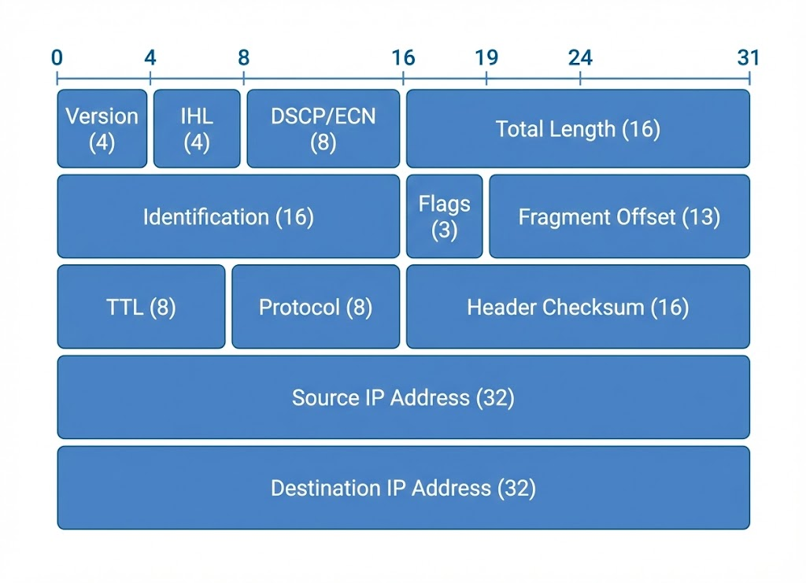
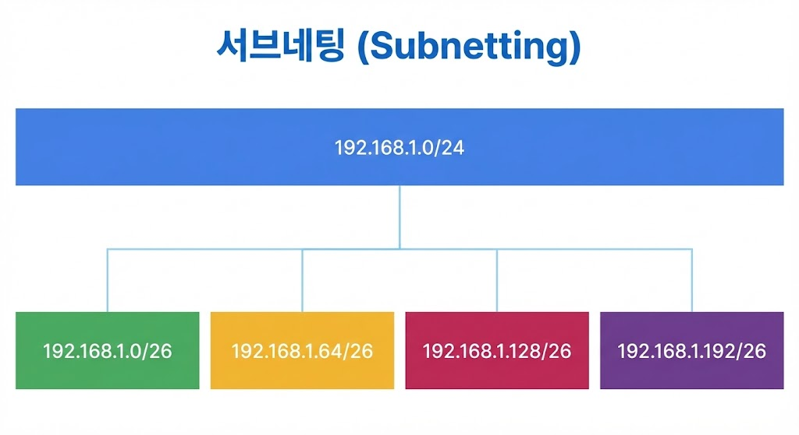

# 03 IP 주소와 서브넷 (학습 노트)

:::note[섹션 개요]
제목: 03 IP 주소와 서브넷 (학습 노트)
키워드: 핵심 개념, 실습, 점검
학습 목표:
- 사설 IP 대역과 NAT 이유를 설명한다.
- 브로드캐스트 주소 설명 가능
:::

## 03.1 목표

> 그림 03-1. /24를 /26으로 분할


> 그림 03-2. IPv4 헤더 요약

- IPv4 주소 구조를 정확히 이해한다.
- CIDR 계산을 손으로 할 수 있다.
- 사설 IP 대역과 NAT 이유를 설명한다.

---

## 03.2 IPv4 구조
IPv4는 32비트 주소이며, 8비트씩 4구간으로 표현한다.

```
192.168.10.25
11000000.10101000.00001010.00011001
```

### 네트워크/호스트 구분
- 네트워크 비트: 네트워크 구분
- 호스트 비트: 장치 구분

---

## 03.3 CIDR 표기
- 예: 10.0.0.0/24
- /24는 네트워크 비트 24개

### 호스트 수 계산
- 사용 가능 호스트 = 2^(호스트 비트) - 2
- 이유: 네트워크 주소 + 브로드캐스트 주소

### 자주 쓰는 CIDR
- /24: 256개 주소 (사용 254)
- /26: 64개 주소 (사용 62)
- /28: 16개 주소 (사용 14)

---

## 03.4 사설 IP 대역
- 10.0.0.0/8
- 172.16.0.0/12
- 192.168.0.0/16

사설 IP는 인터넷에서 라우팅되지 않으며 NAT가 필요하다.

---

## 03.5 실습 1: 서브넷 계산 문제
### 문제
`192.168.10.0/26`의 네트워크/브로드캐스트/호스트 범위?

### 풀이
- /26 → 호스트 비트 6개
- 주소 블록 크기 = 64

```
네트워크: 192.168.10.0
브로드캐스트: 192.168.10.63
사용 가능: 192.168.10.1 ~ 192.168.10.62
```

---

## 03.6 실습 2: 내 IP 범위 확인

### macOS
```shellsession
mac> ipconfig getifaddr en0
mac> ifconfig en0 | grep netmask
```

### Windows (PowerShell)
```shellsession
win> ipconfig
win> Get-NetIPAddress
```

### Linux
```shellsession
lin> ip addr show
```

---

## 03.7 실습 3: 서브넷 분할 예시
### 요구사항
- 192.168.1.0/24를 4개 네트워크로 분할

### 결과
- /26 네트워크 4개

```
192.168.1.0/26
192.168.1.64/26
192.168.1.128/26
192.168.1.192/26
```

---

## 03.8 체크리스트
- /24, /26, /28 즉시 계산 가능
- 사설 IP 대역 암기
- 브로드캐스트 주소 설명 가능

## 03.9 복습 문제
1) /27의 호스트 수는?
2) 10.0.0.0/8는 사설 IP인가?
3) 왜 브로드캐스트 주소는 사용 불가인가?

---

## 03.10 심화 이론: 서브넷팅 직관
- /24 → 마지막 옥텟이 호스트
- /25 → 절반으로 나뉨 (0~127, 128~255)
- /26 → 64 단위 블록

### 빠른 계산 팁
- 블록 크기 = 256 - 서브넷 마스크 마지막 값
- 예: /26 마스크는 255.255.255.192 → 블록 64

---

## 03.11 OS별 실습: 서브넷 확인

### macOS
```shellsession
mac> ifconfig en0 | grep inet
mac> ipcalc 192.168.10.25/26
```

### Windows
```shellsession
win> ipconfig
win> powershell "ipcalc 192.168.10.25/26"
```

### Linux
```shellsession
lin> ip addr show
lin> ipcalc 192.168.10.25/26
```

---

## 03.12 실전 시나리오
### 상황: 서로 다른 팀이 IP 충돌
- 서브넷 경계 계산 실수
- 주소 계획 문서화 필요

---

## 03.13 문제 + 모범답안
1) **문제**: /28의 블록 크기는?
   **답**: 16.
2) **문제**: 192.168.1.64/26의 브로드캐스트?
   **답**: 192.168.1.127.

## 03.14 출판 심화: 바이너리 계산 예시
IP는 2진수로 계산하면 정확도가 높다.

### 예시: 192.168.10.25/26
```
192 = 11000000
168 = 10101000
10  = 00001010
25  = 00011001
/26 → 마지막 옥텟의 상위 2비트가 네트워크
```

### 실전 팁
- 블록 크기만 기억하면 빠른 계산 가능
- /26 → 블록 64 → 0,64,128,192

---
## 03.15 실전 사례
- 사례 1: 서로 다른 팀 IP 충돌 → 서브넷 설계 오류.
- 사례 2: 특정 서브넷만 통신 불가 → 라우팅 누락.
- 사례 3: 브로드캐스트 폭주 → 서브넷 과도하게 큼.
---
## 03.16 장애 분석 리포트 템플릿
- 발생 시각:
- 증상:
- 영향 범위:
- 원인:
- 해결:
- 재발 방지:

---
## 03.x 초보자용 자세한 설명

### 서브넷이 왜 필요한가
- 네트워크를 잘게 나눠 **충돌/혼잡을 줄이고** 보안을 강화하기 위해서다.

### 왜 -2를 하는가
- 네트워크 주소와 브로드캐스트 주소는 예약되어 사용 불가다.

---
## 초보자 Q&A
Q1) 개념이 너무 어렵다. 어디부터 보면 되나?
A1) 그림 → 요약 → 실습 순으로 반복하면 이해가 빨라진다.

Q2) 실습이 실패하면?
A2) IP/라우팅/DNS/포트 순으로 원인을 좁혀라.

---
## 초보자 완전 해설

### IP는 집 주소, 서브넷은 동네
- IP: 특정 집의 주소
- 서브넷: 같은 동네(같은 네트워크)

### 왜 서브넷을 나누나
- 동네가 너무 크면 방송(브로드캐스트)이 너무 많이 퍼져서 느려진다.
- 보안을 위해 팀별로 나누기도 한다.

### -2가 필요한 이유
- 첫 주소는 "동네 이름"(네트워크 주소)
- 마지막 주소는 "동네 방송"(브로드캐스트)

---
## 초보자 미니 퀴즈
1) 인바운드는 어느 방향인가?
2) DNS는 왜 필요한가?
3) TCP가 UDP보다 느린 이유는?

### 정답
1) 밖 → 안
2) 이름을 IP로 바꾸기 위해
3) 확인/재전송 과정이 있기 때문

