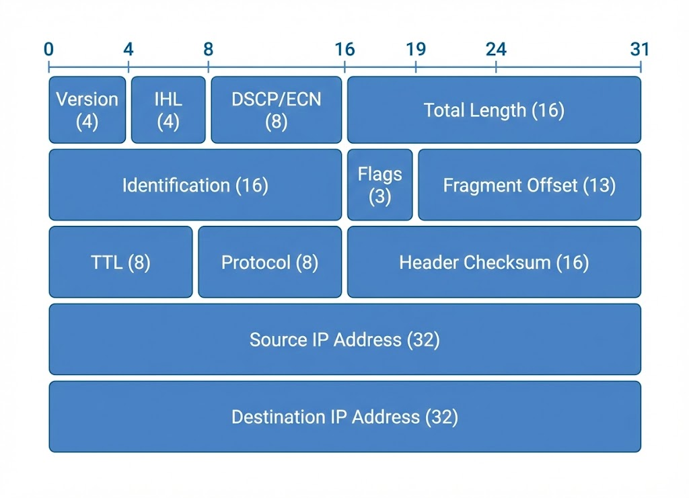
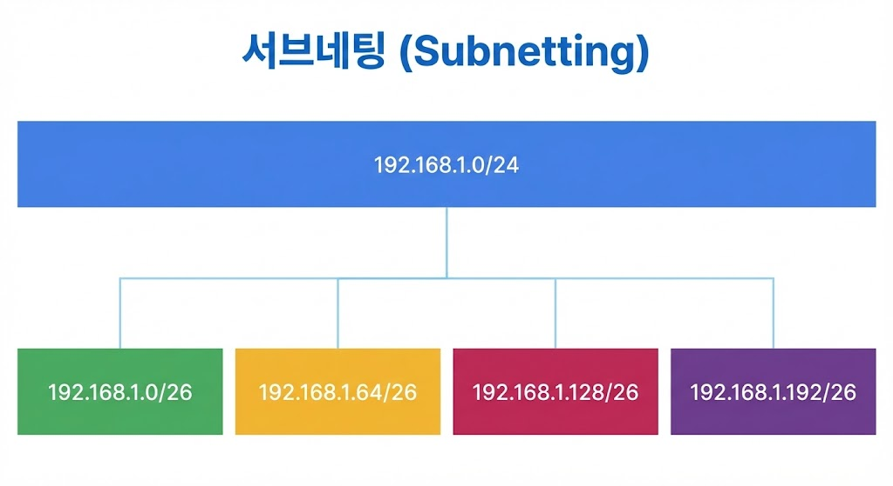

---

:::note[섹션 개요]

- 사설 IP 대역과 NAT 이유를 설명한다.
- 브로드캐스트 주소 설명 가능
- IPv4 주소 구조를 정확히 이해한다.
- CIDR 계산을 손으로 할 수 있다.

:::

---

## 03.1 IPv4 구조

IPv4는 32비트 주소이며, 8비트씩 4구간으로 표현한다.

```
192.168.10.25
11000000.10101000.00001010.00011001
```



> 그림 03-1. IPv4 헤더 요약

### 네트워크/호스트 구분

- 네트워크 비트: 네트워크 구분
- 호스트 비트: 장치 구분

### IPv4 헤더에서 자주 보는 필드

서브넷과 직접 연결되는 건 아니지만, 네트워크 트러블슈팅에서 자주 마주친다.

- **TTL**: 패킷이 지나갈 수 있는 최대 홉 수. 0이 되면 폐기된다.
- **DF/MF (단편화)**: MTU보다 큰 패킷이 단편화 가능한지 여부.
- **Total Length**: 패킷 전체 길이. MTU/단편화 이슈 판단에 유용.
- **Protocol**: 상위 프로토콜 식별 (TCP/UDP/ICMP 등).

---

## 03.2 CIDR 표기

- 예: 10.0.0.0/24
- /24는 네트워크 비트 24개

### 호스트 수 계산

- 사용 가능 호스트 = 2^(호스트 비트) - 2
- 이유: 네트워크 주소 + 브로드캐스트 주소

### 자주 쓰는 CIDR

- /24: 256개 주소 (사용 254)
- /26: 64개 주소 (사용 62)
- /28: 16개 주소 (사용 14)

### 자주 쓰는 마스크 표

- /24 → 255.255.255.0 → 블록 256
- /25 → 255.255.255.128 → 블록 128
- /26 → 255.255.255.192 → 블록 64
- /27 → 255.255.255.224 → 블록 32
- /28 → 255.255.255.240 → 블록 16
- /29 → 255.255.255.248 → 블록 8
- /30 → 255.255.255.252 → 블록 4
- /32 → 255.255.255.255 → 단일 호스트

---

## 03.3 사설 IP 대역

- 10.0.0.0/8
- 172.16.0.0/12
- 192.168.0.0/16

사설 IP는 인터넷에서 라우팅되지 않으며 NAT가 필요하다.

### 왜 NAT가 필요한가

- 사설 IP는 공인 인터넷에서 **직접 라우팅 불가**
- 외부 통신을 위해 **공인 IP로 변환**이 필요
- 대역 충돌을 피하려면 **주소 계획**이 중요

---

## 03.4 실습 1: 서브넷 계산 문제

### 문제

`192.168.10.0/26`의 네트워크/브로드캐스트/호스트 범위?

### 풀이

- /26 → 호스트 비트 6개
- 주소 블록 크기 = 64

```
네트워크: 192.168.10.0
브로드캐스트: 192.168.10.63
사용 가능: 192.168.10.1 ~ 192.168.10.62
```

---

## 03.5 실습 2: 내 IP 범위 확인

### macOS

```shellsession
mac> ipconfig getifaddr en0
mac> ifconfig en0 | grep netmask
```

### Windows (PowerShell)

```shellsession
win> ipconfig
win> Get-NetIPAddress
```

### Linux

```shellsession
lin> ip addr show
```

---

## 03.6 실습 3: 서브넷 분할 예시

### 요구사항

- 192.168.1.0/24를 4개 네트워크로 분할

### 결과

- /26 네트워크 4개

```
192.168.1.0/26
192.168.1.64/26
192.168.1.128/26
192.168.1.192/26
```



> 그림 03-2. /24를 /26으로 분할

:::note[서브넷이 왜 필요한가]

- 네트워크를 잘게 나눠 **충돌/혼잡을 줄이고** 보안을 강화하기 위해서다.
- IP: 특정 집의 주소
- 서브넷: 같은 동네(같은 네트워크)
  :::

### 실무 팁: 주소 계획 기본 원칙

- 향후 확장을 고려해 **여유 블록**을 남겨둔다.
- 사설 대역 사용 시 **중복 충돌**을 피하도록 기록한다.
- 동일 환경에서 **규칙적인 CIDR 패턴**을 유지한다.

---

## 03.7 체크리스트

- /24, /26, /28 즉시 계산 가능
- 사설 IP 대역 암기
- 브로드캐스트 주소 설명 가능

---

## 03.8 복습 문제

1. /27의 호스트 수는?
2. 10.0.0.0/8는 사설 IP인가?
3. 왜 브로드캐스트 주소는 사용 불가인가?

---

## 03.9 심화 이론: 서브넷팅 직관

- /24 → 마지막 옥텟이 호스트
- /25 → 절반으로 나뉨 (0~127, 128~255)
- /26 → 64 단위 블록

### 빠른 계산 팁

- 블록 크기 = 256 - 서브넷 마스크 마지막 값
- 예: /26 마스크는 255.255.255.192 → 블록 64

### 헷갈리기 쉬운 포인트

- **/31**: 포인트 투 포인트 링크에서는 사용 가능 (일반 호스트용은 비권장)
- **/32**: 단일 호스트 라우팅에 사용
- **브로드캐스트 주소**는 항상 마지막 주소

---

## 03.10 OS별 실습: 서브넷 확인

### macOS

```shellsession
mac> ifconfig en0 | grep inet
mac> ipcalc 192.168.10.25/26
```

### Windows

```shellsession
win> ipconfig
win> powershell "ipcalc 192.168.10.25/26"
```

### Linux

```shellsession
lin> ip addr show
lin> ipcalc 192.168.10.25/26
```

---

## 03.11 실전 시나리오

### 상황: 서로 다른 팀이 IP 충돌

- 서브넷 경계 계산 실수
- 주소 계획 문서화 필요

### 추가 시나리오: MTU/단편화 문제

- 큰 패킷이 중간 장비에서 드롭
- 해결: MTU 확인, DF 플래그 체크, 경로 MTU 탐지

---

## 03.12 문제 + 모범답안

1. **문제**: /28의 블록 크기는?
   **답**: 16.
2. **문제**: 192.168.1.64/26의 브로드캐스트?
   **답**: 192.168.1.127.

---

## 03.13 심화: 바이너리 계산 예시

IP는 2진수로 계산하면 정확도가 높다.

### 예시: 192.168.10.25/26

```
192 = 11000000
168 = 10101000
10  = 00001010
25  = 00011001
/26 → 마지막 옥텟의 상위 2비트가 네트워크
```

### 실전 팁

- 블록 크기만 기억하면 빠른 계산 가능
- /26 → 블록 64 → 0,64,128,192

---

## 03.14 실전 사례

- 사례 1: 서로 다른 팀 IP 충돌 → 서브넷 설계 오류.
- 사례 2: 특정 서브넷만 통신 불가 → 라우팅 누락.
- 사례 3: 브로드캐스트 폭주 → 서브넷 과도하게 큼.

---
