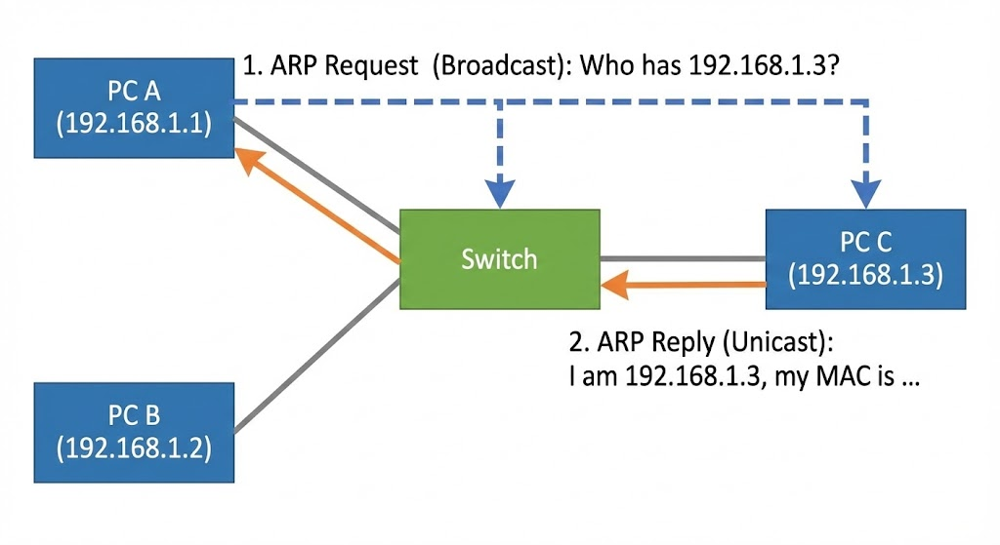

# 04 L2 스위칭 (학습 노트)

:::note[섹션 개요]
제목: 04 L2 스위칭 (학습 노트)
키워드: 핵심 개념, 실습, 점검
학습 목표:
- 스위치가 프레임을 전달하는 방식을 설명한다.
- MAC 주소와 IP 주소 차이 설명 가능
- ARP 과정 설명 가능
:::

## 04.1 목표

> 그림 04-1. 스위치와 ARP 브로드캐스트

- MAC 주소와 ARP 역할을 이해한다.
- 스위치가 프레임을 전달하는 방식을 설명한다.

---

## 04.2 MAC 주소
- 48비트 고유 식별자
- 같은 네트워크 안에서 장치를 구분

## 04.3 스위치 동작 원리
스위치는 **MAC 주소 테이블**을 만든다.

### 동작 흐름
1) 프레임 수신
2) 출발지 MAC을 테이블에 기록
3) 목적지 MAC이 테이블에 있으면 해당 포트로 전달
4) 없으면 플러딩

```text
[PC A] --\
          [SWITCH] ---- [PC B]
[PC C] --/
```

---

## 04.4 ARP (IP → MAC)
IP 주소만 알고 있을 때 MAC 주소를 얻는 프로토콜

### 과정
1) ARP Request (브로드캐스트)
2) ARP Reply (유니캐스트)

```
A: "192.168.0.20 누구야?" (브로드캐스트)
B: "나야. MAC=aa:bb:cc:dd:ee:ff" (유니캐스트)
```

---

## 04.5 실습 1: ARP 캐시 확인

### macOS
```shellsession
mac> arp -a
mac> ping -c 1 192.168.0.1
mac> arp -a | head -n 5
```

### Windows (PowerShell)
```shellsession
win> arp -a
win> ping 192.168.0.1
win> arp -a
```

### Linux
```shellsession
lin> ip neigh
lin> ping -c 1 192.168.0.1
lin> ip neigh
```

### 예상 출력
```
? (192.168.0.1) at xx:xx:xx:xx:xx:xx on en0
```

---

## 04.6 실습 2: VM 두 대로 동일 서브넷 통신

### 단계
1) VM1, VM2 생성
2) 둘 다 Internal Network (intnet1)
3) IP 지정

```shellsession
vm1> sudo ip addr add 10.0.1.10/24 dev enp0s3
vm2> sudo ip addr add 10.0.1.20/24 dev enp0s3
```

4) ping 테스트
```shellsession
vm1> ping -c 3 10.0.1.20
```

### 예상 출력
```
64 bytes from 10.0.1.20: icmp_seq=1 ttl=64 time=0.6 ms
```

---

## 04.7 체크리스트
- MAC 주소와 IP 주소 차이 설명 가능
- ARP 과정 설명 가능
- 같은 서브넷 통신 성공

## 04.8 복습 문제
1) 스위치가 프레임을 전달하는 기준은?
2) ARP 요청이 브로드캐스트인 이유는?
3) MAC 주소는 몇 비트인가?

---

## 04.9 심화 이론: 브로드캐스트 도메인
- 스위치 내부는 **하나의 브로드캐스트 도메인**
- 라우터가 도메인을 분리

## 04.10 실전 시나리오
### 상황: ARP 폭주
- 증상: 네트워크 전체 느려짐
- 원인: 루프(Spanning Tree 미적용)

---

## 04.11 OS별 추가 실습: MAC 확인
### macOS
```shellsession
mac> ifconfig en0 | grep ether
```

### Windows
```shellsession
win> getmac /v
```

### Linux
```shellsession
lin> ip link | grep ether
```

---

## 04.12 문제 + 모범답안
1) **문제**: ARP는 어떤 계층에서 동작하는가?
   **답**: 데이터링크 계층(2계층).
2) **문제**: 스위치가 모르는 목적지 프레임을 어떻게 처리하는가?
   **답**: 플러딩.

---
## 04.13 실전 사례
- 사례 1: ARP 테이블 오염 → 스푸핑 의심.
- 사례 2: 브로드캐스트 폭주 → 루프 발생.
- 사례 3: 특정 포트만 느림 → 스위치 포트 오류.
---
## 04.14 장애 분석 리포트 템플릿
- 발생 시각:
- 증상:
- 영향 범위:
- 원인:
- 해결:
- 재발 방지:

---
## 04.x 초보자용 자세한 설명

### ARP는 왜 필요한가
- IP 주소로는 실제 장비를 찾을 수 없다.
- 같은 네트워크 안에서는 **MAC 주소**를 알아야 전송이 가능하다.

### 스위치는 어떻게 배달하는가
- 스위치는 들어온 출발지 MAC을 기억한다.
- 목적지 MAC을 모르면 모두에게 뿌린 뒤(플러딩) 응답을 학습한다.

---
## 초보자 Q&A
Q1) 개념이 너무 어렵다. 어디부터 보면 되나?
A1) 그림 → 요약 → 실습 순으로 반복하면 이해가 빨라진다.

Q2) 실습이 실패하면?
A2) IP/라우팅/DNS/포트 순으로 원인을 좁혀라.

---
## 초보자 완전 해설

### MAC 주소는 주민등록번호 같은 것
- 같은 동네에서만 쓰는 고유 번호

### ARP는 전화번호부
- "IP 주소는 아는데 MAC은 몰라" → ARP로 묻는다.

### 플러딩이 왜 필요?
- 상대의 MAC을 모르니 일단 전체 방송
- 응답이 오면 그 주소를 기억한다

---
## 초보자 미니 퀴즈
1) 인바운드는 어느 방향인가?
2) DNS는 왜 필요한가?
3) TCP가 UDP보다 느린 이유는?

### 정답
1) 밖 → 안
2) 이름을 IP로 바꾸기 위해
3) 확인/재전송 과정이 있기 때문

