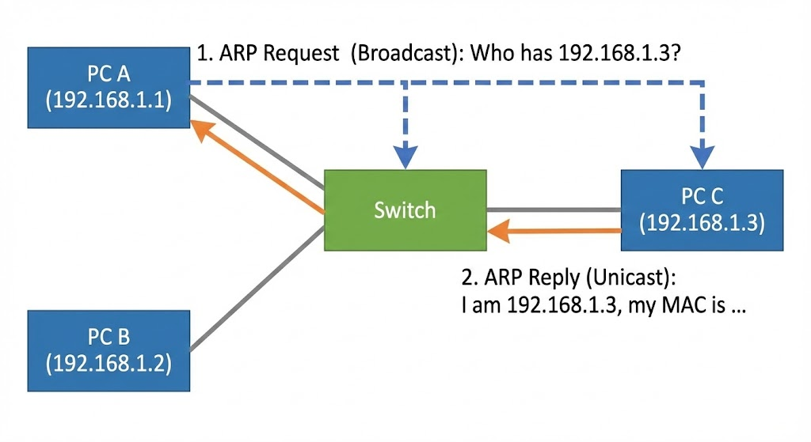

---

:::note[섹션 개요]

- 스위치가 프레임을 전달하는 방식을 설명한다.
- MAC 주소와 IP 주소 차이 설명 가능
- ARP 과정 설명 가능
- MAC 주소와 ARP 역할을 이해한다.
  :::

---

## 05.1 MAC 주소

- 48비트 고유 식별자
- 같은 네트워크 안에서 장치를 구분

## 05.2 스위치 동작 원리

스위치는 **MAC 주소 테이블**을 만든다.

### 동작 흐름

1. 프레임 수신
2. 출발지 MAC을 테이블에 기록
3. 목적지 MAC이 테이블에 있으면 해당 포트로 전달
4. 없으면 플러딩

:::note[플러딩이란]

- 수신처 주소(MAC)를 모를 때, 스위치가 수신 포트를 제외한 모든 포트로 무조건 복사하여 전달.
  :::

```text
[PC A] --\
          [SWITCH] ---- [PC B]
[PC C] --/
```

---

## 05.3 ARP (IP → MAC)

IP 주소만 알고 있을 때 MAC 주소를 얻는 프로토콜

### ARP는 왜 필요한가

- IP 주소로는 실제 장비를 찾을 수 없다.
- 같은 네트워크 안에서는 **MAC 주소**를 알아야 전송이 가능하다.

### 과정

1. ARP Request (브로드캐스트)
2. ARP Reply (유니캐스트)

```
A: "192.168.0.20 누구야?" (브로드캐스트)
B: "나야. MAC=aa:bb:cc:dd:ee:ff" (유니캐스트)
```



> 그림 05-1. 스위치와 ARP 브로드캐스트

---

## 05.4 실습 1: ARP 캐시 확인

### macOS

```shellsession
mac> arp -a
mac> ping -c 1 192.168.0.1
mac> arp -a | head -n 5
```

### Windows (PowerShell)

```shellsession
win> arp -a
win> ping 192.168.0.1
win> arp -a
```

### Linux

```shellsession
lin> ip neigh
lin> ping -c 1 192.168.0.1
lin> ip neigh
```

### 예상 출력

```
? (192.168.0.1) at xx:xx:xx:xx:xx:xx on en0
```

---

## 05.5 실습 2: VM 두 대로 동일 서브넷 통신

### 단계

1. VM1, VM2 생성
2. 둘 다 Internal Network (intnet1)
3. IP 지정

```shellsession
vm1> sudo ip addr add 10.0.1.10/24 dev enp0s3
vm2> sudo ip addr add 10.0.1.20/24 dev enp0s3
```

4. ping 테스트

```shellsession
vm1> ping -c 3 10.0.1.20
```

### 예상 출력

```
64 bytes from 10.0.1.20: icmp_seq=1 ttl=64 time=0.6 ms
```

---

## 05.6 체크리스트

- MAC 주소와 IP 주소 차이 설명 가능
- ARP 과정 설명 가능
- 같은 서브넷 통신 성공

## 05.7 복습 문제

1. 스위치가 프레임을 전달하는 기준은?
2. ARP 요청이 브로드캐스트인 이유는?
3. MAC 주소는 몇 비트인가?

---

## 05.8 심화 이론: 브로드캐스트 도메인

- 스위치 내부는 **하나의 브로드캐스트 도메인**
- 라우터가 도메인을 분리

## 05.9 실전 시나리오

### 상황: ARP 폭주

- 증상: 네트워크 전체 느려짐
- 원인: 루프(Spanning Tree 미적용)

---

## 05.10 OS별 추가 실습: MAC 확인

### macOS

```shellsession
mac> ifconfig en0 | grep ether
```

### Windows

```shellsession
win> getmac /v
```

### Linux

```shellsession
lin> ip link | grep ether
```

---

## 05.11 문제 + 모범답안

1. **문제**: ARP는 어떤 계층에서 동작하는가?
   **답**: 데이터링크 계층(2계층).
2. **문제**: 스위치가 모르는 목적지 프레임을 어떻게 처리하는가?
   **답**: 플러딩.

---

## 05.12 실전 사례

- 사례 1: ARP 테이블 오염 → 스푸핑 의심.
- 사례 2: 브로드캐스트 폭주 → 루프 발생.
- 사례 3: 특정 포트만 느림 → 스위치 포트 오류.
