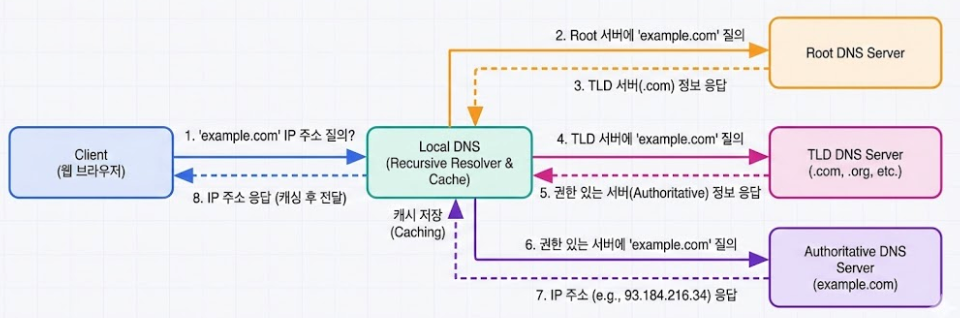

# 06 DNS와 DHCP (학습 노트)

:::note[섹션 개요]
제목: 06 DNS와 DHCP (학습 노트)
키워드: 핵심 개념, 실습, 점검
학습 목표:
- DNS 흐름을 단계별로 설명한다.
- DNS 흐름 단계 설명 가능
- DORA 절차 설명 가능
:::

## 06.1 목표

> 그림 06-1. DNS 조회 흐름

- DNS 흐름을 단계별로 설명한다.
- DHCP DORA 절차를 이해한다.

---

## 06.2 DNS 구조
DNS는 **이름을 IP로 바꾸는 분산 시스템**이다.

### 계층 구조
- 루트 서버
- TLD 서버(.com, .net)
- 권한(Authoritative) 서버

### 조회 과정
1) 로컬 캐시 확인
2) 루트 서버 질의
3) TLD 서버 질의
4) 권한 서버에서 최종 IP 획득

---

## 06.3 DNS 레코드
- A/AAAA: IP
- CNAME: 별칭
- MX: 메일 서버
- TXT: 정책/검증
- NS: 네임서버

---

## 06.4 DHCP
자동 IP 할당 프로토콜

### DORA 절차
1) Discover
2) Offer
3) Request
4) Ack

---

## 06.5 실습 1: DNS 조회

### macOS/Linux
```shellsession
mac> dig example.com
lin> dig example.com
```

### Windows
```shellsession
win> nslookup example.com
```

### 예상 출력
```
example.com.  86400  IN  A  93.184.216.34
```

---

## 06.6 실습 2: DHCP 동작 확인

### macOS
```shellsession
mac> ipconfig getpacket en0
```

### Linux
```shellsession
lin> sudo dhclient -r
lin> sudo dhclient
```

### 예상 출력
```
DHCPACK from 192.168.0.1
bound to 192.168.0.15
```

---

## 06.7 트러블슈팅
- DNS 실패 시: /etc/resolv.conf 확인
- DHCP 실패 시: 케이블/라우터 상태 확인

---

## 06.8 체크리스트
- DNS 흐름 단계 설명 가능
- DORA 절차 설명 가능
- 주요 DNS 레코드 구분 가능

## 06.9 복습 문제
1) CNAME의 역할은?
2) DHCP Offer는 누가 보내는가?
3) 로컬 DNS 캐시는 왜 중요한가?

---

## 06.10 심화 이론: DNS 캐시와 TTL
- DNS 응답에는 TTL이 포함됨
- TTL 동안은 캐시에 저장되어 재질의 감소

## 06.11 실전 시나리오
### 상황: 도메인 변경했는데 접속이 안 됨
- 캐시 TTL 때문에 이전 IP가 남아 있음
- 해결: 캐시 flush 또는 TTL 대기

---

## 06.12 OS별 DNS 캐시 플러시
### macOS
```shellsession
mac> sudo dscacheutil -flushcache
mac> sudo killall -HUP mDNSResponder
```

### Windows
```shellsession
win> ipconfig /flushdns
```

### Linux (systemd-resolved)
```shellsession
lin> sudo resolvectl flush-caches
```

---

## 06.13 문제 + 모범답안
1) **문제**: TTL이 길면 좋은 점과 나쁜 점은?
   **답**: 조회 감소(성능↑) vs 변경 전파 지연.
2) **문제**: DHCP Ack의 역할은?
   **답**: IP 할당 확정 통지.

## 06.14 출판 심화: Recursive vs Iterative
- **Recursive**: 클라이언트 대신 DNS 서버가 끝까지 조회
- **Iterative**: 서버가 다음 서버 정보를 알려줌

### 실무 포인트
- 로컬 DNS는 일반적으로 Recursive
- 권한 서버는 Iterative 응답

---
## 06.15 실전 사례
- 사례 1: 도메인 변경 후 접속 안 됨 → TTL 캐시 문제.
- 사례 2: IP 못 받음 → DHCP 서버 다운.
- 사례 3: 특정 DNS만 실패 → 권한 서버 장애.
---
## 06.16 장애 분석 리포트 템플릿
- 발생 시각:
- 증상:
- 영향 범위:
- 원인:
- 해결:
- 재발 방지:

---
## 06.x 초보자용 자세한 설명

### DNS는 왜 필요한가
- 사람은 이름(example.com)을 기억하고, 컴퓨터는 IP(93.184.216.34)를 사용한다.
- DNS는 그 변환을 담당한다.

### DHCP는 왜 필요한가
- IP를 자동으로 배정해 주지 않으면, 모든 PC에 수동으로 입력해야 한다.
- DHCP는 IP/게이트웨이/DNS를 자동으로 배정한다.

---
## 초보자 Q&A
Q1) 개념이 너무 어렵다. 어디부터 보면 되나?
A1) 그림 → 요약 → 실습 순으로 반복하면 이해가 빨라진다.

Q2) 실습이 실패하면?
A2) IP/라우팅/DNS/포트 순으로 원인을 좁혀라.

---
## 초보자 완전 해설

### DNS는 주소록
- 사람은 이름을 기억하고, 컴퓨터는 숫자를 기억한다
- DNS가 이름을 숫자로 바꿔준다

### DHCP는 자동 배정
- IP/게이트웨이/DNS를 자동으로 나눠준다
- 없으면 모든 PC에 수동 입력해야 한다

---
## 초보자 미니 퀴즈
1) 인바운드는 어느 방향인가?
2) DNS는 왜 필요한가?
3) TCP가 UDP보다 느린 이유는?

### 정답
1) 밖 → 안
2) 이름을 IP로 바꾸기 위해
3) 확인/재전송 과정이 있기 때문

