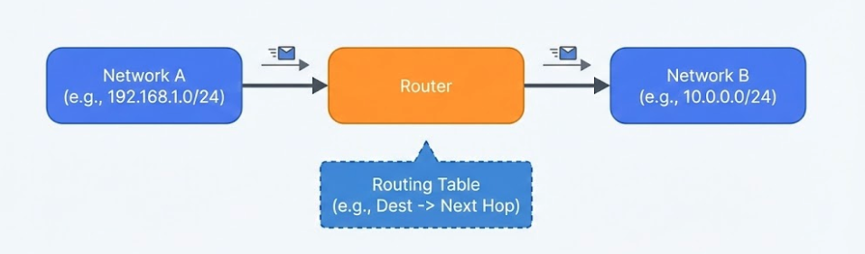

---

:::note[섹션 개요]

- 라우터가 서로 다른 네트워크를 연결하는 원리를 이해한다.
- 라우팅 테이블을 읽고 경로를 추론한다.
  :::

---

## 06.1 라우터란 무엇인가

라우터는 **서로 다른 네트워크 사이의 패킷을 전달**한다.



> 그림 06-1. 라우팅 기본 구조

## 06.2 라우팅 테이블

라우터는 라우팅 테이블을 보고 패킷의 다음 홉을 결정한다.

### 라우팅 테이블 항목

- 목적지 네트워크
- 다음 홉(게이트웨이)
- 출력 인터페이스

### 기본 게이트웨이

- 목적지 네트워크가 명확하지 않을 때 나가는 길

:::note[기본 게이트웨이]

- 다른 네트워크로 나갈 때 반드시 필요하다.
- 없으면 외부 인터넷이 모두 끊긴다.
  :::

---

## 06.3 정적 vs 동적 라우팅

- 정적: 관리자가 직접 설정
- 동적: OSPF/BGP 같은 프로토콜로 자동 학습

---

## 06.4 실습 1: 라우팅 테이블 확인

### macOS

```shellsession
mac> netstat -rn | head -n 10
```

### Windows (PowerShell)

```shellsession
win> route print
```

### Linux

```shellsession
lin> ip route
```

### 예상 출력

```
default via 192.168.0.1 dev en0
```

---

## 06.5 실습 2: VM 라우터 구성

### 목표

VM1(10.0.1.0/24) ↔ VM2(10.0.2.0/24) 통신

### 구성도

```
VM1 (10.0.1.10) --\
                    [VM3 Router]
VM2 (10.0.2.20) --/
```

### 단계

1. VM3에 NIC 2개 설정 (intnet1, intnet2)
2. VM3에서 IP 포워딩 활성화

```shellsession
vm3> sudo sysctl -w net.ipv4.ip_forward=1
```

3. VM3에 IP 할당

```shellsession
vm3> sudo ip addr add 10.0.1.1/24 dev enp0s3
vm3> sudo ip addr add 10.0.2.1/24 dev enp0s8
```

4. VM1/VM2에 라우트 추가

```shellsession
vm1> sudo ip route add 10.0.2.0/24 via 10.0.1.1
vm2> sudo ip route add 10.0.1.0/24 via 10.0.2.1
```

5. 테스트

```shellsession
vm1> ping -c 3 10.0.2.20
```

### 예상 출력

```
64 bytes from 10.0.2.20: icmp_seq=1 ttl=63 time=0.9 ms
```

---

## 06.6 트러블슈팅

- ping 실패 → IP 포워딩 확인
- 라우트 누락 → `ip route` 재확인

---

## 06.7 체크리스트

- 라우팅 테이블 읽기 가능
- 기본 게이트웨이 개념 이해
- VM 라우팅 성공

## 06.8 복습 문제

1. 기본 게이트웨이의 역할은?
2. 동적 라우팅 프로토콜 예시는?
3. 라우팅 테이블에 없으면 어떤 경로로 나가나?

---

## 06.9 심화 이론: 라우팅 결정 순서

1. 가장 긴 프리픽스(길이 긴 경로 우선)
2. 우선순위/메트릭(관리 거리, 비용) 비교
3. 기본 게이트웨이(::/0 또는 0.0.0.0/0)

## 06.10 실전 시나리오

### 상황: 특정 네트워크만 접근 불가

- 라우팅 테이블에 경로 없음
- 잘못된 넥스트홉

---

## 06.11 OS별 추가 실습: 라우트 추가/삭제

### macOS

```shellsession
mac> sudo route -n add 10.0.2.0/24 192.168.0.1
mac> sudo route -n delete 10.0.2.0/24
```

### Windows

```shellsession
win> route add 10.0.2.0 mask 255.255.255.0 192.168.0.1
win> route delete 10.0.2.0
```

### Linux

```shellsession
lin> sudo ip route add 10.0.2.0/24 via 192.168.0.1
lin> sudo ip route del 10.0.2.0/24
```

---

## 06.12 문제 + 모범답안

1. **문제**: 라우터가 경로를 선택할 때 가장 먼저 보는 것은?
   **답**: 가장 긴 프리픽스 매치.
2. **문제**: 기본 게이트웨이가 없는 경우 어떤 문제가 생기는가?
   **답**: 다른 네트워크로 나가는 트래픽이 모두 실패.

## 06.13 심화: Longest Prefix Match 예시

라우터는 가장 긴 프리픽스를 우선한다.

### 예시

- 10.0.0.0/8 → 게이트웨이 A
- 10.0.1.0/24 → 게이트웨이 B

목적지가 10.0.1.5라면 **/24가 더 구체적이므로 B를 선택**한다.

---

## 06.14 실전 사례

- 사례 1: 특정 대역 접근 불가 → 라우팅 테이블 누락.
- 사례 2: 간헐적 라우팅 루프 → 잘못된 경로 광고.
- 사례 3: 지연 급증 → 비효율 경로 선택.
