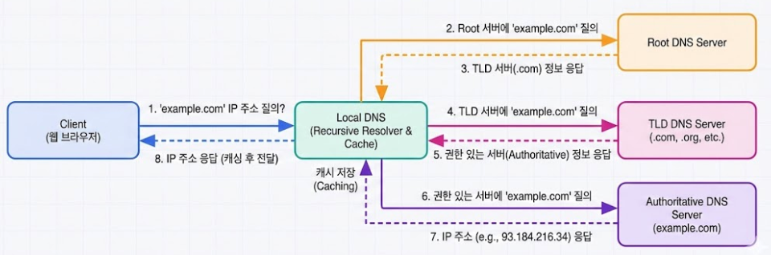

---

## DNS 구조

DNS(Domain Name System)는 **이름을 IP로 바꾸는 분산 시스템**이다.

### DNS는 왜 필요한가

- 사람은 이름(example.com)을 기억하고, 컴퓨터는 IP를 사용한다.
- DNS는 그 변환을 담당한다.

### 계층 구조

- 루트 서버
- TLD 서버(.com, .net)
- 권한(Authoritative) 서버

### 조회 과정

1. 로컬 캐시 확인
2. 루트 서버 질의
3. TLD 서버 질의
4. 권한 서버에서 최종 IP 획득



> DNS 조회 흐름

---

## DNS 레코드

- **A/AAAA**: 도메인 → IP/IPv6)
- **CNAME**: 도메인 별칭(다른 도메인으로 연결)
- **MX**: 메일을 받을 서버
- **TXT**: 정책/검증용 텍스트 정보
- **NS**: 해당 도메인을 담당하는 네임서버

---

## DHCP(Dynamic Host Configuration Protocol)

자동 IP 할당 프로토콜

### DHCP는 자동 배정

- IP/게이트웨이/DNS를 자동으로 나눠준다
- 없으면 모든 PC에 수동 입력해야 한다

### DORA(Discover, Offer, Request, Acknowledge) 절차

1. Discover
2. Offer
3. Request
4. Ack

---

## 실습 1: DNS 조회

### macOS/Linux

```shellsession
mac> dig example.com
lin> dig example.com
```

### Windows

```shellsession
win> nslookup example.com
```

### 예상 출력

```
example.com.  86400  IN  A  93.184.216.34
```

---

## 실습 2: DHCP 동작 확인

### macOS

```shellsession
mac> ipconfig getpacket en0
```

### Linux

```shellsession
lin> sudo dhclient -r
lin> sudo dhclient
```

### 예상 출력

```
DHCPACK from 192.168.0.1
bound to 192.168.0.15
```

---

## 트러블슈팅

- DNS 실패 시: /etc/resolv.conf 확인
- DHCP 실패 시: 케이블/라우터 상태 확인

---

## DNS 캐시와 TTL

- DNS 응답에는 TTL이 포함됨
- TTL 동안은 캐시에 저장되어 재질의 감소

## 실전 시나리오

### 상황: 도메인 변경했는데 접속이 안 됨

- 캐시 TTL 때문에 이전 IP가 남아 있음
- 해결: 캐시 flush 또는 TTL 대기

---

## OS별 DNS 캐시 플러시

### macOS

```shellsession
mac> sudo dscacheutil -flushcache
mac> sudo killall -HUP mDNSResponder
```

### Windows

```shellsession
win> ipconfig /flushdns
```

### Linux (systemd-resolved)

```shellsession
lin> sudo resolvectl flush-caches
```

---

## Recursive vs Iterative

- **Recursive**: 클라이언트 대신 DNS 서버가 끝까지 조회
- **Iterative**: 서버가 다음 서버 정보를 알려줌

### 실무 포인트

- 로컬 DNS는 일반적으로 Recursive
- 권한 서버는 Iterative 응답

---

## 실전 사례

- 사례 1: 도메인 변경 후 접속 안 됨 → TTL 캐시 문제.
- 사례 2: IP 못 받음 → DHCP 서버 다운.
- 사례 3: 특정 DNS만 실패 → 권한 서버 장애.
