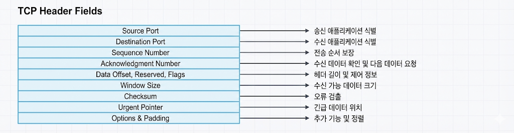

# 07 TCP와 UDP (학습 노트)

:::note[섹션 개요]
제목: 07 TCP와 UDP (학습 노트)
키워드: 핵심 개념, 실습, 점검
학습 목표:
- TCP/UDP 차이를 정확히 설명한다.
- TCP 3-way handshake 순서 설명 가능
- UDP가 필요한 상황 설명 가능
:::

## 07.1 목표

> 그림 07-1. UDP 헤더 요약


> 그림 07-2. TCP 헤더 요약


> 그림 07-3. 헤더 필드 주석 예시


> 그림 07-4. TCP 옵션 대표 예시


> 그림 07-5. TCP 3-way handshake

- TCP/UDP 차이를 정확히 설명한다.
- 3-way handshake 흐름을 이해한다.
- tcpdump로 패킷을 해석할 수 있다.

---

## 07.2 TCP 특징
- 연결 지향
- 신뢰성 보장 (순서/재전송)
- 흐름 제어/혼잡 제어

### 3-way handshake
```
Client -> SYN
Server -> SYN, ACK
Client -> ACK
```

### 왜 필요한가
- 양쪽이 통신 준비가 되었는지 확인
- 초기 시퀀스 번호 동기화

---

## 07.3 UDP 특징
- 비연결
- 빠르지만 신뢰성 없음
- 실시간 스트리밍/VoIP/게임에 적합

---

## 07.4 실습 1: TCP 핸드셰이크 관찰

### 준비
```shellsession
mac> sudo tcpdump -i en0 tcp port 80
```

### 실행
1) tcpdump 실행
2) 브라우저로 http://example.com 접속

### 예상 출력(요약)
```
SYN
SYN, ACK
ACK
```

---

## 07.5 실습 2: UDP 테스트 (netcat)

### 터미널 1
```shellsession
lin> nc -u -l 9999
```

### 터미널 2
```shellsession
lin> echo "hello" | nc -u 127.0.0.1 9999
```

### 예상 출력
```
hello
```

---

## 07.6 체크리스트
- TCP 3-way handshake 순서 설명 가능
- UDP가 필요한 상황 설명 가능
- tcpdump 출력에서 SYN/ACK 확인 가능

## 07.7 복습 문제
1) TCP가 신뢰성을 보장하는 방법은?
2) UDP는 어떤 상황에서 더 적합한가?
3) 3-way handshake에서 두 번째 메시지는?

---

## 07.8 심화 이론: TCP 혼잡 제어(핵심)
- **슬로우 스타트**: 처음엔 천천히 전송량 증가
- **혼잡 회피**: 임계치 넘으면 증가 속도 완화
- **패킷 손실 감지**: 재전송/윈도우 축소

## 07.9 시퀀스 다이어그램 (3-way handshake)
```
Client                Server
  | ---- SYN -------> |
  | <--- SYN,ACK ---- |
  | ---- ACK -------> |
```

---

## 07.10 OS별 실습: 연결 상태 확인
### macOS
```shellsession
mac> netstat -an | grep ESTABLISHED | head -n 5
```

### Windows
```shellsession
win> netstat -an | find "ESTABLISHED"
```

### Linux
```shellsession
lin> ss -ant | head -n 5
```

---

## 07.11 문제 + 모범답안
1) **문제**: TCP가 신뢰성을 보장하는 방법 2가지는?
   **답**: 재전송, 순서 보장(시퀀스 번호).
2) **문제**: 슬로우 스타트의 목적은?
   **답**: 혼잡을 피하면서 안전하게 전송량 증가.

## 07.12 출판 심화: 슬라이딩 윈도우
TCP는 송신/수신 윈도우 크기를 조절해 **전송 효율을 최적화**한다.

### 핵심 개념
- 윈도우 크기가 크면 처리량이 좋아짐
- 네트워크 혼잡 시 윈도우를 줄여 안정성 확보

---
## 07.13 실전 사례
- 사례 1: TCP 연결 느림 → 혼잡 제어/손실 영향.
- 사례 2: UDP 스트리밍 깨짐 → 손실/지터 영향.
- 사례 3: 재전송 급증 → 링크 품질 문제.
---
## 07.14 장애 분석 리포트 템플릿
- 발생 시각:
- 증상:
- 영향 범위:
- 원인:
- 해결:
- 재발 방지:

---
## 07.x 초보자용 자세한 설명

### TCP가 느리지만 안정적인 이유
- 데이터가 도착했는지 확인하고, 빠진 부분은 다시 보내기 때문이다.

### UDP가 빠른 이유
- 확인 절차가 없어서 빠르지만, 손실이 생겨도 그대로 진행한다.

---
## 초보자 Q&A
Q1) 개념이 너무 어렵다. 어디부터 보면 되나?
A1) 그림 → 요약 → 실습 순으로 반복하면 이해가 빨라진다.

Q2) 실습이 실패하면?
A2) IP/라우팅/DNS/포트 순으로 원인을 좁혀라.

---
## 초보자 완전 해설

### TCP는 "확인하고 보내는" 택배
- 보냈는지 확인하고, 안 오면 다시 보낸다

### UDP는 "빠른 퀵배송"
- 확인 절차를 줄여 속도는 빠르지만 손실 가능

### 그래서 어디에 쓰나
- TCP: 웹, 파일 전송
- UDP: 게임, 영상, 통화

---
## 초보자 미니 퀴즈
1) 인바운드는 어느 방향인가?
2) DNS는 왜 필요한가?
3) TCP가 UDP보다 느린 이유는?

### 정답
1) 밖 → 안
2) 이름을 IP로 바꾸기 위해
3) 확인/재전송 과정이 있기 때문

