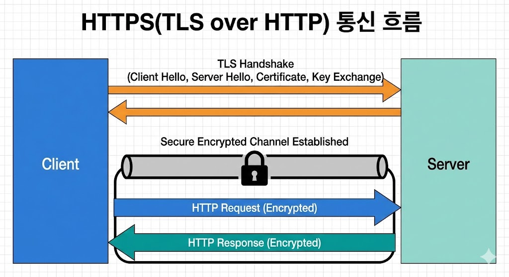

# 08 HTTP와 TLS (학습 노트)

:::note[섹션 개요]
제목: 08 HTTP와 TLS (학습 노트)
키워드: 핵심 개념, 실습, 점검
학습 목표:
- HTTP 요청/응답 구조를 설명한다.
- HTTP 요청/응답 구조 설명 가능
- TLS 핸드셰이크 목적 설명 가능
:::

## 08.1 목표

> 그림 08-1. HTTPS(HTTP over TLS) 통신 흐름

- HTTP 요청/응답 구조를 설명한다.
- TLS 핸드셰이크 흐름을 이해한다.

---

## 08.2 HTTP 구조
- 요청: 메서드, 경로, 헤더, 바디
- 응답: 상태코드, 헤더, 바디

```
GET / HTTP/1.1
Host: example.com

HTTP/1.1 200 OK
Content-Type: text/html
```

### 주요 상태코드
- 200 OK
- 301 Redirect
- 404 Not Found
- 500 Server Error

---

## 08.3 TLS (HTTPS)
- 대칭키 + 공개키 혼합
- 인증서로 서버 신뢰 확인

### TLS 흐름 요약
1) Client Hello
2) Server Hello + 인증서
3) 키 교환
4) 대칭키로 암호화 통신

---

## 08.4 실습 1: HTTP 요청 확인
```shellsession
mac> curl -v http://example.com
```

### 예상 출력(요약)
```
> GET / HTTP/1.1
< HTTP/1.1 200 OK
```

---

## 08.5 실습 2: TLS 핸드셰이크 확인
```shellsession
mac> openssl s_client -connect example.com:443
```

### 예상 출력(요약)
```
Protocol  : TLSv1.3
Cipher    : TLS_AES_256_GCM_SHA384
```

---

## 08.6 체크리스트
- HTTP 요청/응답 구조 설명 가능
- TLS 핸드셰이크 목적 설명 가능
- curl/openssl로 검증 가능

## 08.7 복습 문제
1) HTTP 301의 의미는?
2) TLS에서 인증서가 필요한 이유는?
3) HTTPS는 어떤 계층에 속하는가?

---

## 08.8 심화 이론: HTTP Keep-Alive
- 하나의 TCP 연결로 여러 요청 처리
- 지연 감소

## 08.9 심화 이론: TLS 인증서 검증
- 체인 검증(루트 CA까지)
- 만료/호스트명 확인

---

## 08.10 OS별 실습: 인증서 확인
### macOS
```shellsession
mac> openssl s_client -connect example.com:443 -servername example.com
```

### Windows
```shellsession
win> openssl s_client -connect example.com:443 -servername example.com
```

### Linux
```shellsession
lin> openssl s_client -connect example.com:443 -servername example.com
```

---

## 08.11 문제 + 모범답안
1) **문제**: HTTP Keep-Alive의 장점은?
   **답**: TCP 재연결 비용 감소.
2) **문제**: TLS에서 인증서 체인이 필요한 이유는?
   **답**: 신뢰를 루트 CA까지 검증하기 위해.

---
## 08.12 실전 사례
- 사례 1: HTTPS 오류 → 인증서 만료.
- 사례 2: 리다이렉트 반복 → 설정 오류.
- 사례 3: 응답 느림 → Keep-Alive 미사용.
---
## 08.13 장애 분석 리포트 템플릿
- 발생 시각:
- 증상:
- 영향 범위:
- 원인:
- 해결:
- 재발 방지:

---

## 8.x TLS/PKI 기본 구조
TLS는 **PKI(공개키 기반 구조)** 위에서 동작한다.

### 구성 요소
- **CA**: 인증서 발급 기관
- **인증서**: 서버 신원 증명
- **공개키/개인키**: 암호화/복호화

### 왜 필요한가
- 중간자 공격 방지
- 서버 신원 보장

## 실무 포인트
- 인증서 만료일 관리 필수
- SAN(Subject Alternative Name) 확인 중요

---
## 08.x 초보자용 자세한 설명

### HTTP는 무엇인가
- 브라우저가 서버에 요청을 보내고, 서버가 응답을 보내는 규칙이다.

### TLS는 무엇인가
- 통신 내용을 암호화하고, 서버가 진짜인지 검증한다.
- 인증서가 없거나 만료되면 보안 경고가 뜬다.

---
## 초보자 Q&A
Q1) 개념이 너무 어렵다. 어디부터 보면 되나?
A1) 그림 → 요약 → 실습 순으로 반복하면 이해가 빨라진다.

Q2) 실습이 실패하면?
A2) IP/라우팅/DNS/포트 순으로 원인을 좁혀라.

---
## 초보자 완전 해설

### HTTP는 대화 규칙
- "주세요"(요청) → "여기 있어요"(응답)

### TLS는 안전한 자물쇠
- 통신을 암호화해서 도청을 막는다
- 인증서로 서버가 진짜인지 확인한다

---
## 초보자 미니 퀴즈
1) 인바운드는 어느 방향인가?
2) DNS는 왜 필요한가?
3) TCP가 UDP보다 느린 이유는?

### 정답
1) 밖 → 안
2) 이름을 IP로 바꾸기 위해
3) 확인/재전송 과정이 있기 때문

