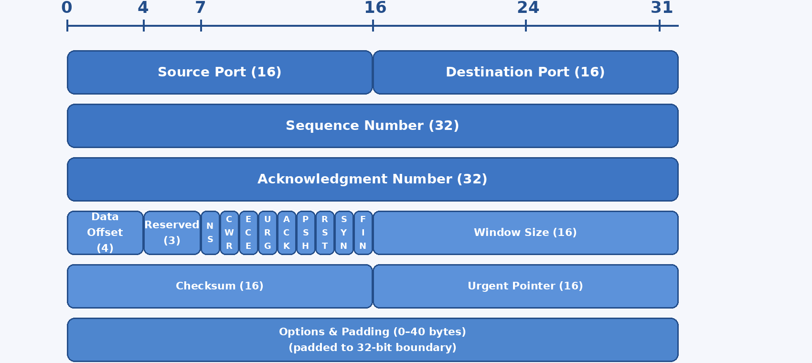
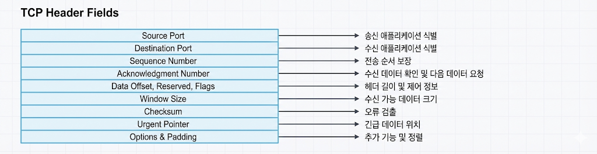
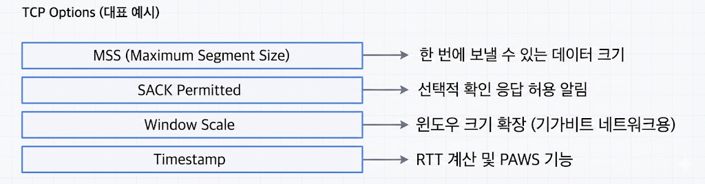
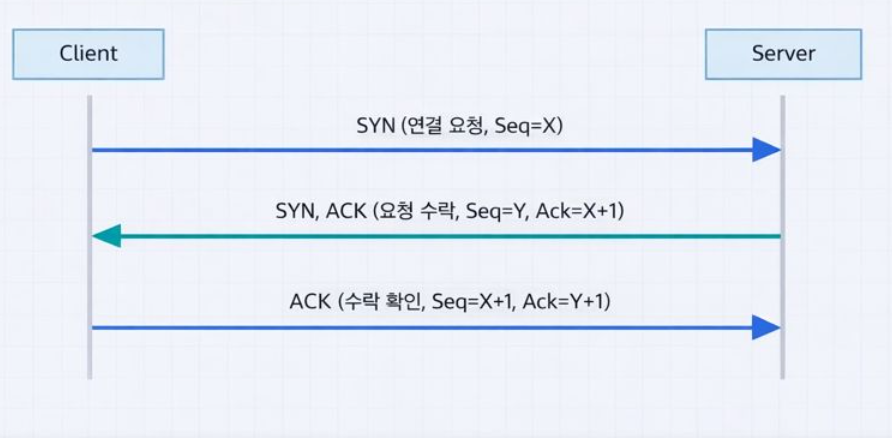
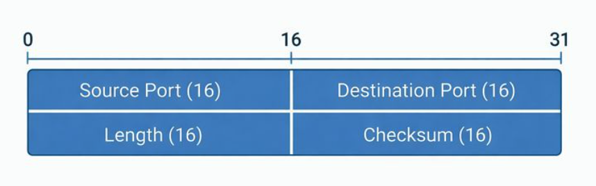

---

## TCP/UDP 개요

- TCP(Transmission Control Protocol): 신뢰성 중심, 연결 지향
- UDP(User Datagram Protocol): 지연 최소화, 비연결

## TCP 특징

- 연결 지향
- 신뢰성 보장 (순서/재전송)
- 흐름 제어/혼잡 제어
- 웹, 파일 전송에 적합



> TCP 헤더 요약



> 헤더 필드 주석 예시



> TCP 옵션 대표 예시

### 3-way handshake



> TCP 3-way handshake

### 왜 필요한가

- 양쪽이 통신 준비가 되었는지 확인
- 초기 시퀀스 번호 동기화

### TCP가 느리지만 안정적인 이유

- 데이터가 도착했는지 확인하고, 빠진 부분은 다시 보내기 때문이다.

---

## UDP 특징

- 비연결
- 빠르지만 신뢰성 없음
- 실시간 스트리밍/VoIP/게임/통화에 적합



> UDP 헤더 요약

### UDP가 빠른 이유

- 확인 절차가 없어서 빠르지만, 손실이 생겨도 그대로 진행한다.

---

## 실습 1: TCP 핸드셰이크 관찰

### 준비

```shellsession
mac> sudo tcpdump -i en0 tcp port 80
```

### 실행

1. tcpdump 실행
2. 브라우저로 http://example.com 접속

### 예상 출력(요약)

```
SYN
SYN, ACK
ACK
```

---

## 실습 2: UDP 테스트 (netcat)

### 터미널 1

```shellsession
lin> nc -u -l 9999
```

### 터미널 2

```shellsession
lin> echo "hello" | nc -u 127.0.0.1 9999
```

### 예상 출력

```
hello
```

---

## TCP 혼잡 제어

- **슬로우 스타트**: 처음엔 천천히 전송량 증가
- **혼잡 회피**: 임계치 넘으면 증가 속도 완화
- **패킷 손실 감지**: 재전송/윈도우 축소

## 시퀀스 다이어그램 (3-way handshake)

```
Client                Server
  | ---- SYN -------> |
  | <--- SYN,ACK ---- |
  | ---- ACK -------> |
```

---

## OS별 실습: 연결 상태 확인

### macOS

```shellsession
mac> netstat -an | grep ESTABLISHED | head -n 5
```

### Windows

```shellsession
win> netstat -an | find "ESTABLISHED"
```

### Linux

```shellsession
lin> ss -ant | head -n 5
```

---

## 슬라이딩 윈도우

TCP는 송신/수신 윈도우 크기를 조절해 **전송 효율을 최적화**한다.

### 핵심 개념

- 윈도우 크기가 크면 처리량이 좋아짐
- 네트워크 혼잡 시 윈도우를 줄여 안정성 확보

---

## 실전 사례

- 사례 1: TCP 연결 느림 → 혼잡 제어/손실 영향.
- 사례 2: UDP 스트리밍 깨짐 → 손실/지터 영향.
- 사례 3: 재전송 급증 → 링크 품질 문제.
