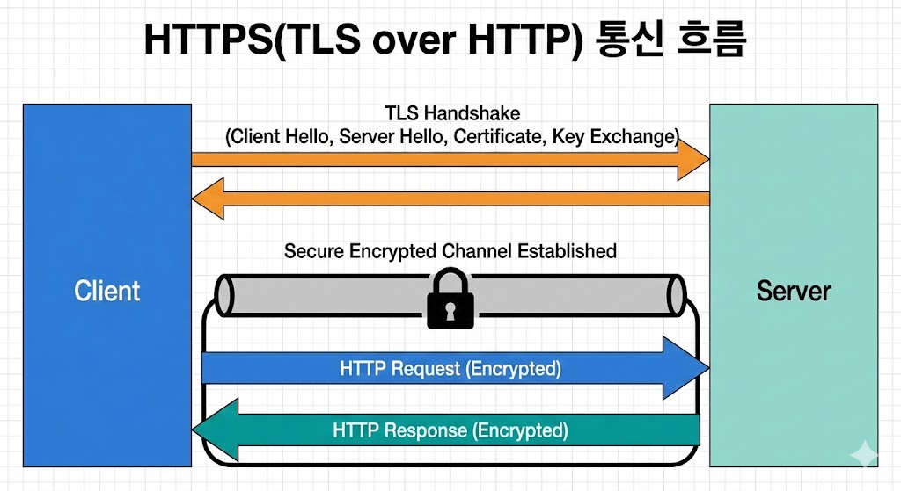

---

## HTTP(Hypertext Transfer Protocol) 구조

- 브라우저가 서버에 요청을 보내고, 서버가 응답을 보내는 규칙이다.
- 요청: 메서드, 경로, 헤더, 바디
- 응답: 상태코드, 헤더, 바디

```
GET / HTTP/1.1
Host: example.com

HTTP/1.1 200 OK
Content-Type: text/html
```

### 주요 상태코드

- 200 OK
- 301 Redirect
- 404 Not Found
- 500 Server Error

---

## TLS(Transport Layer Security)

- 통신 내용을 암호화하고, 서버가 진짜인지 검증한다.
- 인증서가 없거나 만료되면 보안 경고가 뜬다.
- 대칭키 + 공개키 혼합
- 인증서로 서버 신뢰 확인

### TLS 흐름 요약

1. Client Hello
2. Server Hello + 인증서
3. 키 교환
4. 대칭키로 암호화 통신



> HTTPS 통신 흐름

---

## 실습 1: HTTP 요청 확인

```shellsession
mac> curl -v http://example.com
```

### 예상 출력(요약)

```
> GET / HTTP/1.1
< HTTP/1.1 200 OK
```

---

## 실습 2: TLS 핸드셰이크 확인

```shellsession
mac> openssl s_client -connect example.com:443
```

### 예상 출력(요약)

```
Protocol  : TLSv1.3
Cipher    : TLS_AES_256_GCM_SHA384
```

---

## HTTP Keep-Alive

- 하나의 TCP 연결로 여러 요청 처리
- 지연 감소

## TLS 인증서 검증

- 체인 검증(루트 CA까지)
- 만료/호스트명 확인

---

## OS별 실습: 인증서 확인

### macOS

```shellsession
mac> openssl s_client -connect example.com:443 -servername example.com
```

### Windows

```shellsession
win> openssl s_client -connect example.com:443 -servername example.com
```

### Linux

```shellsession
lin> openssl s_client -connect example.com:443 -servername example.com
```

---

## 실전 사례

- 사례 1: HTTPS 오류 → 인증서 만료.
- 사례 2: 리다이렉트 반복 → 설정 오류.
- 사례 3: 응답 느림 → Keep-Alive 미사용.

---

## TLS/PKI 기본 구조

TLS는 **PKI(공개키 기반 구조)** 위에서 동작한다.

### 구성 요소

- **CA**: 인증서 발급 기관
- **인증서**: 서버 신원 증명
- **공개키/개인키**: 암호화/복호화

### 왜 필요한가

- 중간자 공격 방지
- 서버 신원 보장

## 실무 포인트

- 인증서 만료일 관리 필수
- SAN(Subject Alternative Name) 확인 중요
