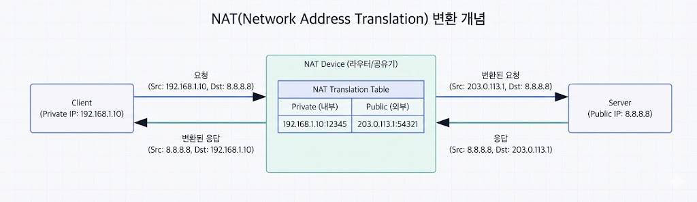

---

:::note[섹션 개요]

- 인바운드/아웃바운드 차이 설명 가능
- 방화벽 정책을 읽고 이해한다.
- NAT의 종류(SNAT/DNAT)를 구분한다.
  :::

---

## 10.1 방화벽 기본

- 인바운드/아웃바운드 규칙
- 기본 정책 (기본 차단 vs 기본 허용)

### 인바운드/아웃바운드란

- **인바운드**: 외부 → 내부로 들어오는 트래픽
- **아웃바운드**: 내부 → 외부로 나가는 트래픽


> 그림 10-1. 방화벽 비유

### 인바운드 예시

- 22/SSH 허용
- 80/HTTP 허용
- 그 외 차단


> 그림 10-2. 방화벽 룰 예시

### 방화벽 규칙 읽는 방법

- 조건: 출발지/목적지/포트/프로토콜
- 행동: 허용(Allow) 또는 차단(Deny)
- 보통 규칙은 위에서 아래로 검사한다.

#### 방화벽 룰 읽기 쉬운 방법

- "누가(출발지)" → "어디로(목적지)" → "무슨 문(포트)" → "허용/차단"

---

## 10.2 NAT

사설 IP를 공인 IP로 변환하는 기술

### NAT가 필요한 이유

- 내부 IP는 인터넷에서 직접 라우팅되지 않는다.
- NAT가 공인 IP로 변환해 외부와 통신 가능하게 한다.



> 그림 10-3. NAT 변환 개념

### SNAT

- 내부 → 외부

### DNAT

- 외부 → 내부 (포트 포워딩)

```text
[10.0.0.5] --(SNAT)--> [1.2.3.4]
```

---

## 10.3 실습 1: 로컬 방화벽 확인

### macOS

```shellsession
mac> sudo pfctl -sr | head -n 20
```

### Windows

```shellsession
win> Get-NetFirewallRule | select -First 5
```

### Linux

```shellsession
lin> sudo iptables -L | head -n 20
```

---

## 10.4 실습 2: 포트 차단 테스트 (Linux VM)

### VM2에서 8080 차단

```shellsession
vm2> sudo iptables -A INPUT -p tcp --dport 8080 -j DROP
```

### VM1에서 접속

```shellsession
vm1> curl http://10.0.2.20:8080
```

### 예상 결과

- 연결 실패 또는 timeout

### 복구

```shellsession
vm2> sudo iptables -F
```

---

## 10.5 체크리스트

- 인바운드/아웃바운드 차이 설명 가능
- SNAT/DNAT 차이 이해
- 방화벽 테스트 성공

## 10.6 복습 문제

1. DNAT의 사용 사례는?
2. 기본 차단 정책의 장점은?
3. 포트 차단 시 클라이언트 증상은?

---

## 10.7 심화 이론: 상태 기반 방화벽

- 연결 상태를 추적
- 응답 패킷은 자동 허용 가능

## 10.8 실전 시나리오

### 상황: 외부에서 내부 서비스 접속 필요

- DNAT(포트 포워딩) 설정

---

## 10.9 OS별 포트 리스닝 확인

### macOS

```shellsession
mac> lsof -iTCP -sTCP:LISTEN | head -n 5
```

### Windows

```shellsession
win> netstat -ano | find "LISTEN"
```

### Linux

```shellsession
lin> ss -lntp | head -n 5
```

---

## 10.10 문제 + 모범답안

1. **문제**: 상태 기반 방화벽의 장점은?
   **답**: 응답 패킷을 자동으로 허용해 관리가 쉽다.
2. **문제**: DNAT는 언제 쓰나?
   **답**: 외부 요청을 내부 서버로 전달할 때.

## 10.11 심화: Stateless vs Stateful

- **Stateless**: 패킷 단위 필터링
- **Stateful**: 연결 상태를 추적

### 차이점

- Stateful은 응답 트래픽을 자동 허용 가능
- Stateless는 룰이 많아지고 관리가 어렵다

---

## 10.12 실전 사례

- 사례 1: 외부 접속 불가 → 포트 포워딩 누락.
- 사례 2: 내부 서비스 접근 실패 → 인바운드 차단.
- 사례 3: 특정 포트만 차단 → 룰 순서 문제.

---

## 10.13 NAT 심화: PAT(포트 주소 변환)

PAT는 여러 사설 IP를 **하나의 공인 IP + 포트**로 변환한다.

### 예시

- 내부 10.0.0.10:50000 → 공인 1.2.3.4:40001
- 내부 10.0.0.11:50001 → 공인 1.2.3.4:40002

### 실무 포인트

- 대부분 가정/기업 NAT는 PAT 방식
- 포트 충돌 관리가 중요
