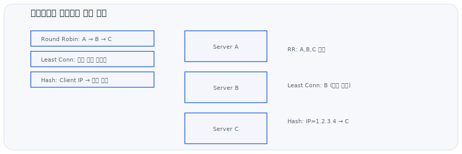
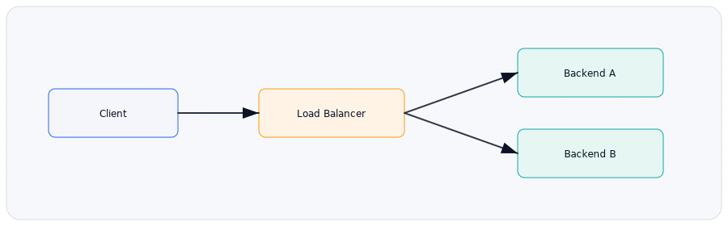

# 10 로드밸런싱 (학습 노트)

:::note[섹션 개요]
제목: 10 로드밸런싱 (학습 노트)
키워드: 핵심 개념, 실습, 점검
학습 목표:
- L4/L7 차이를 설명한다.
- L4/L7 차이 설명 가능
:::

## 10.1 목표

> 그림 10-1. 로드밸런서 구조


> 그림 10-2. 로드밸런싱 알고리즘 예시

- 로드밸런서의 역할을 이해한다.
- L4/L7 차이를 설명한다.

---

## 10.2 로드밸런서란
- 트래픽 분산
- 장애 시 자동 우회

### 대표 알고리즘
- 라운드 로빈
- 최소 연결
- 해시 기반

---

## 10.3 L4 vs L7
- L4: TCP/UDP 기반
- L7: HTTP 기반 (URL, 헤더 조건 가능)

---

## 10.4 실습: 로컬 로드밸런싱(Nginx)

### 구성
- VM2: 백엔드1 (8081)
- VM3: 백엔드2 (8082)
- VM1: 로드밸런서 (80)

### VM2/VM3 서버 실행
```shellsession
vm2> python3 -m http.server 8081
vm3> python3 -m http.server 8082
```

### VM1 Nginx 설치
```shellsession
vm1> sudo apt update
vm1> sudo apt install -y nginx
```

### /etc/nginx/nginx.conf 예시
```
upstream backend {
    server 10.0.2.20:8081;
    server 10.0.2.30:8082;
}

server {
    listen 80;
    location / {
        proxy_pass http://backend;
    }
}
```

### 테스트
```shellsession
vm1> curl http://10.0.1.10
```

### 예상 결과
- 요청이 백엔드로 번갈아 전달

---

## 10.5 체크리스트
- L4/L7 차이 설명 가능
- Nginx로 로드밸런싱 구성 가능

## 10.6 복습 문제
1) L7 로드밸런서가 가능한 추가 기능은?
2) 라운드 로빈의 장점은?

---

## 10.7 심화 이론: 세션 고정(Sticky Session)
- 특정 사용자를 항상 같은 백엔드로 보냄
- 상태 저장형 앱에 필요

## 10.8 실전 시나리오
### 상황: 로그인 세션이 자꾸 풀림
- 세션 고정 미사용
- 공유 세션 스토리지 필요

---

## 10.9 OS별 추가 실습: 헬스체크
### Linux (curl)
```shellsession
lin> while true; do curl -s http://10.0.1.10 | head -n 1; sleep 1; done
```

---

## 10.10 문제 + 모범답안
1) **문제**: L7 로드밸런서가 가능한 추가 기능은?
   **답**: URL/헤더 기반 라우팅.
2) **문제**: 세션 고정이 필요한 이유는?
   **답**: 상태를 서버에 저장하는 앱 때문.

## 10.11 출판 심화: 헬스체크 설계
헬스체크는 단순 포트 확인이 아니라 **앱의 정상 응답**을 확인해야 한다.

### 예시
- `/health` 엔드포인트
- DB 연결 여부 확인

---
## 10.12 실전 사례
- 사례 1: 로그인 풀림 → 세션 고정 필요.
- 사례 2: 일부 서버만 과부하 → 알고리즘 문제.
- 사례 3: 헬스체크 실패 → 잘못된 엔드포인트.
---
## 10.13 장애 분석 리포트 템플릿
- 발생 시각:
- 증상:
- 영향 범위:
- 원인:
- 해결:
- 재발 방지:

---
## 10.x 초보자용 자세한 설명

### 로드밸런서가 필요한 이유
- 한 대의 서버가 감당 못 하는 트래픽을 여러 대로 나눠준다.
- 한 대가 죽어도 서비스가 계속된다.

### 대표 알고리즘 설명
- **라운드 로빈**: 순서대로 하나씩 분배 (균등 분산)
- **최소 연결**: 현재 연결이 가장 적은 서버로 보냄 (불균형 트래픽에 유리)
- **해시 기반**: 특정 값(클라이언트 IP 등)을 해시해 고정 분배 (세션 유지에 유리)

### L4 vs L7 차이
- L4는 포트/프로토콜 기준으로만 분배
- L7은 URL/헤더/쿠키 등 내용을 보고 분배 가능

---
## 초보자 Q&A
Q1) 개념이 너무 어렵다. 어디부터 보면 되나?
A1) 그림 → 요약 → 실습 순으로 반복하면 이해가 빨라진다.

Q2) 실습이 실패하면?
A2) IP/라우팅/DNS/포트 순으로 원인을 좁혀라.

---
## 초보자 완전 해설

### 로드밸런서는 교통정리 경찰
- 한 길로 몰리면 사고 난다 → 여러 길로 나눈다

### 알고리즘 쉽게 이해
- 라운드 로빈: 순서대로 나눔
- 최소 연결: 덜 바쁜 곳으로
- 해시: 같은 사람은 같은 곳으로

---
## 초보자 미니 퀴즈
1) 인바운드는 어느 방향인가?
2) DNS는 왜 필요한가?
3) TCP가 UDP보다 느린 이유는?

### 정답
1) 밖 → 안
2) 이름을 IP로 바꾸기 위해
3) 확인/재전송 과정이 있기 때문

