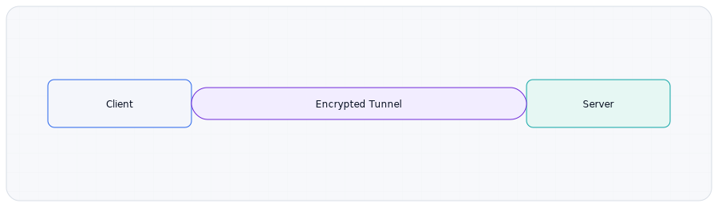

# 11 VPN과 터널 (학습 노트)

:::note[섹션 개요]
제목: 11 VPN과 터널 (학습 노트)
키워드: 핵심 개념, 실습, 점검
학습 목표:
- VPN 터널 개념 설명 가능
:::

## 11.1 목표

> 그림 11-1. VPN 터널 개념

- VPN과 터널링을 이해한다.
- WireGuard 기본 구성을 수행한다.

---

## 11.2 VPN 개념
VPN은 **암호화된 터널**을 통해 안전한 통신을 제공한다.

### 사용 사례
- 회사 내부망 원격 접속
- 데이터 보호

---

## 11.3 WireGuard 개요
- 설정이 단순하고 성능이 좋음

---

## 11.4 실습: WireGuard 터널 구성

### 설치
```shellsession
vm1> sudo apt install -y wireguard
vm2> sudo apt install -y wireguard
```

### 키 생성
```shellsession
vm1> wg genkey | tee privatekey | wg pubkey > publickey
vm2> wg genkey | tee privatekey | wg pubkey > publickey
```

### 설정 파일
VM1 `/etc/wireguard/wg0.conf`
```
[Interface]
Address = 10.10.0.1/24
PrivateKey = <VM1_PRIVATE>

[Peer]
PublicKey = <VM2_PUBLIC>
AllowedIPs = 10.10.0.2/32
Endpoint = 10.0.2.20:51820
```

VM2 `/etc/wireguard/wg0.conf`
```
[Interface]
Address = 10.10.0.2/24
PrivateKey = <VM2_PRIVATE>

[Peer]
PublicKey = <VM1_PUBLIC>
AllowedIPs = 10.10.0.1/32
Endpoint = 10.0.1.10:51820
```

### 실행
```shellsession
vm1> sudo wg-quick up wg0
vm2> sudo wg-quick up wg0
```

### 테스트
```shellsession
vm1> ping -c 3 10.10.0.2
```

---

## 11.5 체크리스트
- VPN 터널 개념 설명 가능
- WireGuard 구성 성공

## 11.6 복습 문제
1) VPN이 필요한 이유는?
2) WireGuard에서 AllowedIPs의 역할은?

---

## 11.7 심화 이론: 터널링과 캡슐화
- 원래 패킷을 다른 패킷 안에 넣어 전송
- 외부에서는 내부 주소가 보이지 않음

## 11.8 실전 시나리오
### 상황: 집에서 회사 내부망 접근
- VPN 연결로 내부망 IP 접근 가능

---

## 11.9 OS별 WireGuard 상태 확인
### Linux
```shellsession
lin> sudo wg show
```

### Windows/macOS
- WireGuard GUI에서 상태 확인

---

## 11.10 문제 + 모범답안
1) **문제**: VPN 터널이 필요한 이유는?
   **답**: 공용 인터넷에서 안전한 통신.
2) **문제**: 터널링의 핵심은?
   **답**: 패킷 캡슐화.

---
## 11.11 실전 사례
- 사례 1: VPN 연결되지만 특정 대역 안 됨 → AllowedIPs 누락.
- 사례 2: 연결이 자주 끊김 → MTU 조정 필요.
- 사례 3: 성능 저하 → 암호화 오버헤드 확인.
---
## 11.12 장애 분석 리포트 템플릿
- 발생 시각:
- 증상:
- 영향 범위:
- 원인:
- 해결:
- 재발 방지:

---
## 11.x 초보자용 자세한 설명

### VPN이 왜 필요한가
- 공용 인터넷에서도 회사 내부망처럼 안전하게 접속하기 위해서다.

### 터널이란
- 원래 데이터를 암호화된 껍질로 감싸서 전달하는 방식이다.

---
## 초보자 Q&A
Q1) 개념이 너무 어렵다. 어디부터 보면 되나?
A1) 그림 → 요약 → 실습 순으로 반복하면 이해가 빨라진다.

Q2) 실습이 실패하면?
A2) IP/라우팅/DNS/포트 순으로 원인을 좁혀라.

---
## 초보자 완전 해설

### VPN은 비밀 통로
- 공용 인터넷 위에 안전한 통로를 만든다

### 왜 쓰나
- 집에서도 회사 내부망처럼 일하기 위해

---
## 초보자 미니 퀴즈
1) 인바운드는 어느 방향인가?
2) DNS는 왜 필요한가?
3) TCP가 UDP보다 느린 이유는?

### 정답
1) 밖 → 안
2) 이름을 IP로 바꾸기 위해
3) 확인/재전송 과정이 있기 때문

