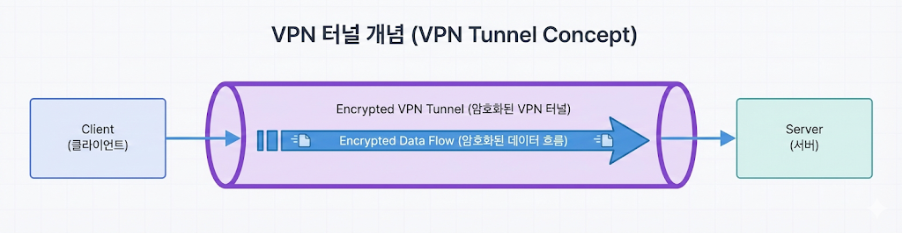

---

## VPN(Virtual Private Network) 개념

VPN은 **암호화된 터널**을 통해 안전한 통신을 제공한다.

### VPN이 왜 필요한가

- 공용 인터넷에서도 회사 내부망처럼 안전하게 접속하기 위해서다.

### 터널이란

- 원래 데이터를 암호화된 껍질로 감싸서 전달하는 방식이다.



> VPN 터널 개념

### 사용 사례

- 회사 내부망 원격 접속
- 데이터 보호

---

## WireGuard 개요

- 설정이 단순하고 성능이 좋음

---

## 실습: WireGuard 터널 구성

### 설치

```shellsession
vm1> sudo apt install -y wireguard
vm2> sudo apt install -y wireguard
```

### 키 생성

```shellsession
vm1> wg genkey | tee privatekey | wg pubkey > publickey
vm2> wg genkey | tee privatekey | wg pubkey > publickey
```

### 설정 파일

VM1 `/etc/wireguard/wg0.conf`

```
[Interface]
Address = 10.10.0.1/24
PrivateKey = <VM1_PRIVATE>

[Peer]
PublicKey = <VM2_PUBLIC>
AllowedIPs = 10.10.0.2/32
Endpoint = 10.0.2.20:51820
```

VM2 `/etc/wireguard/wg0.conf`

```
[Interface]
Address = 10.10.0.2/24
PrivateKey = <VM2_PRIVATE>

[Peer]
PublicKey = <VM1_PUBLIC>
AllowedIPs = 10.10.0.1/32
Endpoint = 10.0.1.10:51820
```

### 실행

```shellsession
vm1> sudo wg-quick up wg0
vm2> sudo wg-quick up wg0
```

### 테스트

```shellsession
vm1> ping -c 3 10.10.0.2
```

---

## 터널링과 캡슐화

- 원래 패킷을 다른 패킷 안에 넣어 전송
- 외부에서는 내부 주소가 보이지 않음

## 실전 시나리오

### 상황: 집에서 회사 내부망 접근

- VPN 연결로 내부망 IP 접근 가능

---

## OS별 WireGuard 상태 확인

### Linux

```shellsession
lin> sudo wg show
```

### Windows/macOS

- WireGuard GUI에서 상태 확인

---

## 실전 사례

- 사례 1: VPN 연결되지만 특정 대역 안 됨 → AllowedIPs 누락.
- 사례 2: 연결이 자주 끊김 → MTU 조정 필요.
- 사례 3: 성능 저하 → 암호화 오버헤드 확인.
