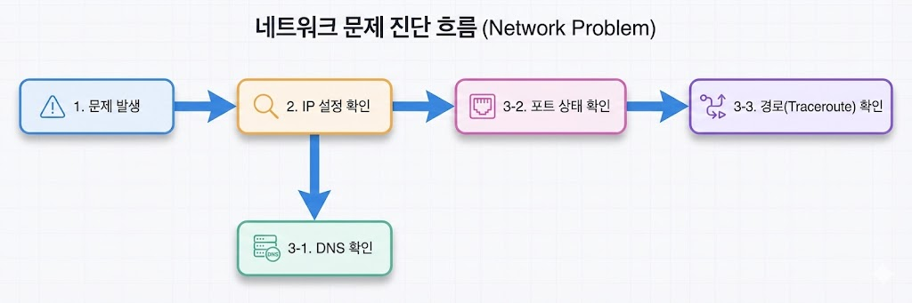

---

:::note[섹션 개요]

- 계층별 진단 흐름을 익힌다.
- 기본 도구로 원인을 좁힐 수 있다.
  :::

---

## 13.1 핵심 도구

- ping: 연결 확인
- traceroute: 경로 확인
- dig/nslookup: DNS 확인
- ss/netstat: 포트 확인
- tcpdump: 패킷 캡처

---

## 13.2 실습: 웹 접속 실패 진단

### 단계 1: IP 확인

```shellsession
mac> ifconfig | grep inet
```

### 단계 2: DNS 확인

```shellsession
mac> dig example.com
```

### 단계 3: 포트 확인

```shellsession
mac> nc -vz example.com 443
```

### 단계 4: 경로 확인

```shellsession
mac> traceroute example.com
```

---

## 13.3 예상 증상 해석

- DNS 실패: 이름 해석 불가
- 포트 실패: 방화벽/서버 문제
- traceroute 중간 끊김: 라우팅 문제

---

## 13.4 체크리스트

- ping/traceroute 사용 가능
- DNS vs 포트 문제 구분 가능
- tcpdump로 패킷 확인 가능

## 13.5 복습 문제

1. traceroute가 보여주는 것은?
2. 포트가 막혀 있으면 어떤 증상이 나타나는가?

---

## 13.6 심화 이론: 장애 분류 표

| 증상           | 의심 계층 | 도구          |
| -------------- | --------- | ------------- |
| IP 없음        | L2/L3     | ipconfig, ip  |
| DNS 실패       | L7        | dig, nslookup |
| 포트 연결 실패 | L4        | nc, telnet    |
| 경로 끊김      | L3        | traceroute    |

### 진단 순서 요약

1. IP 확인 (내가 네트워크에 있는가?)
2. DNS 확인 (이름을 IP로 바꿀 수 있는가?)
3. 포트 확인 (서비스 포트가 열려 있는가?)
4. 경로 확인 (중간에 끊기지 않는가?)



> 그림 13-1. 문제 진단 흐름

---

## 13.7 OS별 도구 설치 팁

- macOS: `brew install iperf3 tcpdump`
- Windows: `choco install wireshark`
- Linux: `sudo apt install iperf3 tcpdump`

---

## 13.8 문제 + 모범답안

1. **문제**: DNS가 실패하면 어떤 증상이 나타나는가?
   **답**: 도메인 이름을 IP로 바꿀 수 없어 접속 불가.
2. **문제**: 포트 차단과 라우팅 문제의 차이는?
   **답**: 포트 차단은 TCP 연결 단계에서 실패, 라우팅 문제는 경로 자체가 없음.

---

## 13.9 실전 사례

- 사례 1: DNS 실패 vs 포트 실패 구분.
- 사례 2: traceroute 중간 끊김 분석.
- 사례 3: tcpdump로 재전송 확인.

---

## 추가 장애 시나리오 (실제 로그 기반)

### 시나리오 1: DNS는 되는데 접속이 안 됨

```shellsession
mac> dig example.com
example.com. 86400 IN A 93.184.216.34
mac> nc -vz example.com 443
nc: connectx to example.com port 443 (tcp) failed: Operation timed out
```

**해석**: DNS 정상, 포트 차단 또는 서버 문제.

### 시나리오 2: 라우팅 문제

```shellsession
lin> ping -c 3 10.0.2.20
connect: Network is unreachable
lin> ip route
(default route 없음)
```

**해석**: 기본 게이트웨이 또는 라우팅 누락.

### 시나리오 3: 패킷 손실 증가

```shellsession
mac> ping -c 20 8.8.8.8
20 packets transmitted, 15 received, 25% packet loss
```

**해석**: 링크 품질 저하, 혼잡 가능성.
