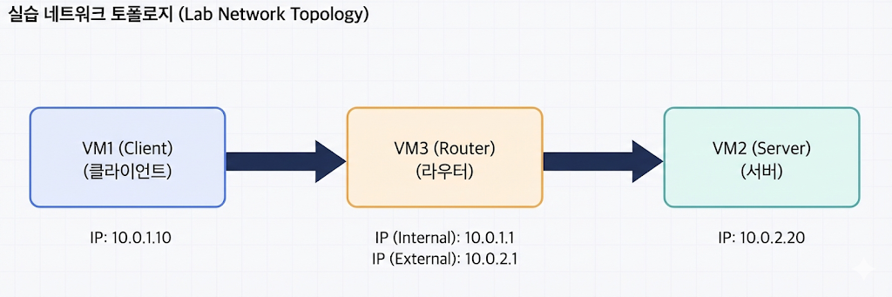

---

:::note[섹션 개요]

- VM 3대를 만들고 네트워크 분리를 구성한다.
- 실습 환경을 재현 가능하게 만든다.
  :::

---

## 14.1 VirtualBox 설치

- 공식 사이트에서 최신 안정 버전 설치
- Extension Pack 설치 권장

## 14.2 VM 기본 설정

### VM 목록

- VM1: client
- VM2: server
- VM3: router

### 권장 사양

- CPU: 1 vCPU
- RAM: 1GB
- Disk: 10GB

---

## 14.3 네트워크 구성

### 네트워크 모드

- VM1: Internal Network (intnet1)
- VM2: Internal Network (intnet2)
- VM3: NIC1=intnet1, NIC2=intnet2



> 그림 14-1. 실습 네트워크 토폴로지

---

## 14.4 Ubuntu 설치 후 설정

### 패키지 업데이트

```shellsession
vm> sudo apt update
```

### SSH 설치

```shellsession
vm> sudo apt install -y openssh-server
```

---

## 14.5 IP 기본 설정

### VM1

```shellsession
vm1> sudo ip addr add 10.0.1.10/24 dev enp0s3
```

### VM2

```shellsession
vm2> sudo ip addr add 10.0.2.20/24 dev enp0s3
```

### VM3

```shellsession
vm3> sudo ip addr add 10.0.1.1/24 dev enp0s3
vm3> sudo ip addr add 10.0.2.1/24 dev enp0s8
```

---

## 14.6 체크리스트

- VM 3대 생성
- VM3 NIC 2개 설정
- IP 설정 완료
- ping 테스트 성공

---

## 14.7 OS별 VirtualBox 설치 요약

### macOS

1. VirtualBox 설치 패키지 실행
2. 보안/개인정보에서 커널 확장 허용
3. 재부팅

### Windows

1. 설치 파일 실행
2. 네트워크 드라이버 설치 허용
3. 재부팅

### Linux

- 배포판별 패키지 설치
- 커널 모듈 활성화 필요

---

## 14.8 실습 전 체크

- VM 간 ping 가능?
- 방화벽이 ICMP를 막고 있지 않은가?
- 네트워크 어댑터가 Internal Network인지 재확인
