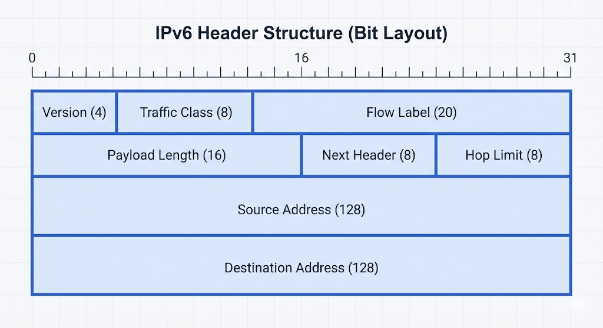

# 17 IPv6 기초

:::note[섹션 개요]
제목: 17 IPv6 기초
키워드: 주소 구조, 듀얼스택, 라우팅
학습 목표:
- IPv6 주소 구조를 이해한다.
- 듀얼스택 환경을 이해한다.
- 기본 라우팅을 이해한다.
:::

## 17.1 IPv6 주소 구조

> 그림 17-1. IPv6 헤더 구조

IPv6는 128비트 주소 체계이며 16비트씩 8블록으로 표현한다.

예시:
```
2001:0db8:85a3:0000:0000:8a2e:0370:7334
```

### 단축 표기 규칙
- 연속된 0 블록은 `::`로 축약 가능 (한 번만 사용 가능)
- 앞의 0은 생략 가능

예:
```
2001:db8:85a3::8a2e:370:7334
```

## 17.2 주소 유형
- **유니캐스트**: 하나의 대상
- **멀티캐스트**: 여러 대상
- **애니캐스트**: 가장 가까운 대상

## 17.3 듀얼스택
IPv4와 IPv6를 함께 사용하는 방식. 점진적 전환에 사용된다.

## 17.4 기본 실습
### macOS
```shellsession
mac> ifconfig | grep inet6
```

### Windows
```shellsession
win> ipconfig
```

### Linux
```shellsession
lin> ip -6 addr show
```

## 체크리스트
- IPv6 주소 구조 설명 가능
- 듀얼스택 개념 이해

---
## 17.x 초보자용 자세한 설명

### IPv6를 알아야 하는 이유
- IPv4 주소는 한계가 있어 IPv6로 전환 중이다.
- 클라우드 환경에서는 IPv6 지원이 점점 필수다.

---
## 초보자 Q&A
Q1) 개념이 너무 어렵다. 어디부터 보면 되나?
A1) 그림 → 요약 → 실습 순으로 반복하면 이해가 빨라진다.

Q2) 실습이 실패하면?
A2) IP/라우팅/DNS/포트 순으로 원인을 좁혀라.

---
## 초보자 완전 해설

### 왜 IPv6가 필요한가
- IPv4 주소가 부족하다
- 앞으로는 IPv6가 표준이 된다

---
## 초보자 미니 퀴즈
1) 인바운드는 어느 방향인가?
2) DNS는 왜 필요한가?
3) TCP가 UDP보다 느린 이유는?

### 정답
1) 밖 → 안
2) 이름을 IP로 바꾸기 위해
3) 확인/재전송 과정이 있기 때문

